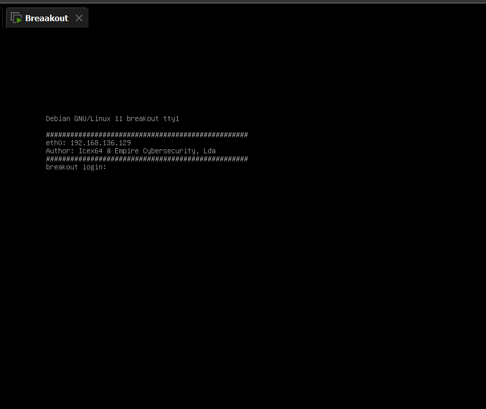
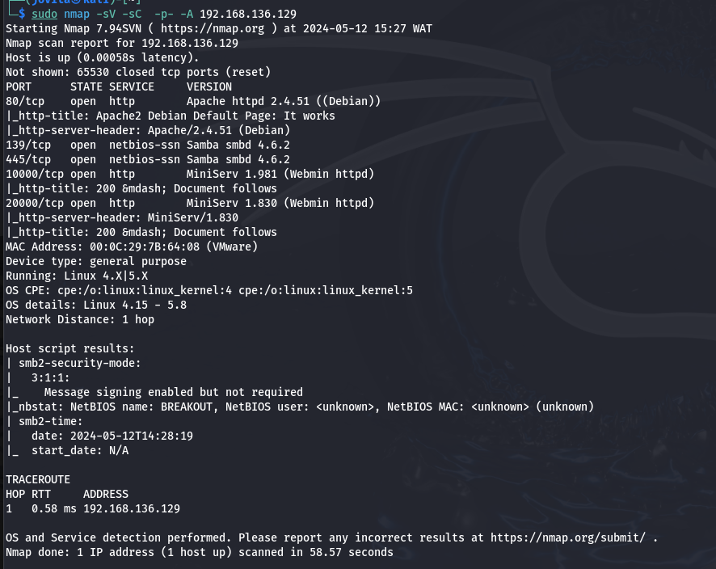
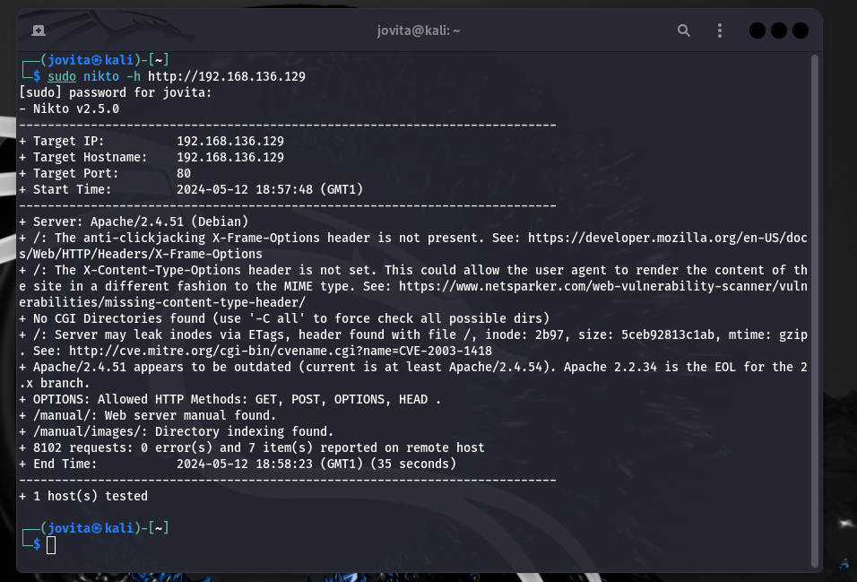

# Empire Breakout Walkthrough

Hi there, Whitej is here with another vulnhub walkthrough. Let the fun begin!😁️


## Connection
We will be pentesting a vulnerable machine called Empire Breakout using the VirtualBox. The connection process can be a headache, even for Network Engineers and Experts. We will be connecting through Bridged Network() 
Firstly find your IP address using 
```sh
ifconfig
```


**Kali (Attack Machine): 192.168.136.128**

Luckily, the machine has already been assigned an IP address and displays it:

 ``` sh
 "IP : 192.168.136.129" 
 ```



 So  we have our **Linux Debian (Victim Machine): 192.168.136.129**

Thank you Mr Breakout😎️!
 
 Things just got a whole lot easier😉️😉️😉️
 
 But to be thorough pentesters that we are, we have to still run our arp scan to see all the connected devices on our network using the arp-scan or netdiscover

```sh 
"sudo arp-scan -l"
```

#### Or

``` sh 
"sudo netdiscover -i eth0 -r <Ip address range>.0/24 "
```

 

 I think we  know the culprit by now

 ## Enumeration

Let start  gathering some juicy info , starting with nmap
We need to know which port is open and what services are running there



From the above results, we see some ports open:

| PORTS  | SERVICES     |
|--------|--------------|
| 80     | HTTP         |
| 139    | SMBD         |
| 445    | SMBD         |
| 10000  | HTTP WEBMIN  |
| 20000  | HTTP WEBMIN  |


The OS is Linux 4.15 -5.8

Using Nikto to check  web vunerabilities

 

