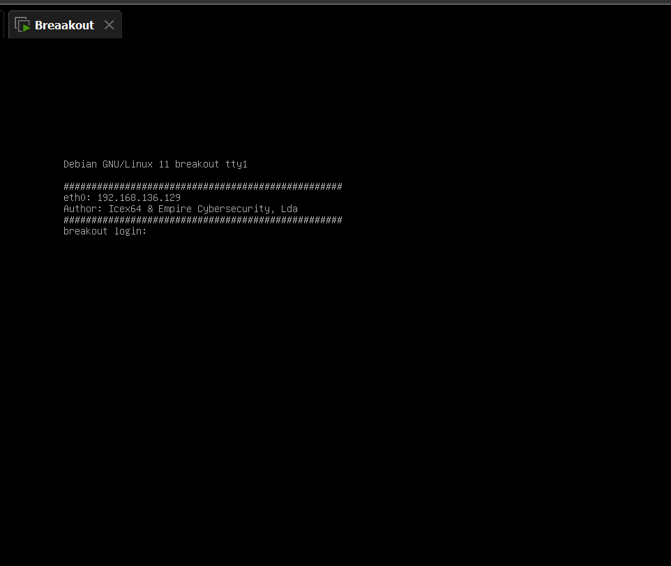
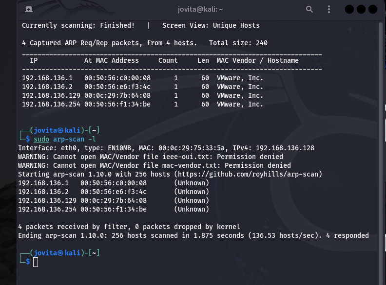

# Empire Breakout Walkthrough

Hi there, Whitej is here with another vulnhub walkthrough. Let the fun begin!😁️

## Connection
We will be pentesting a vulnerable machine called Empire Breakout. The connection process can be a headache, even for Network Engineers and Experts. We will be connecting through NAT, with the following IP addresses:

Kali (Attack Machine): 192.168.136.128
Linux Debian (Victim Machine): 192.168.136.129
Luckily, the machine has already been assigned an IP address and displays it:

 def IP address():
  print("IP : 192.168.136.129")

'

Thank you Mr Breakout😎️!
 
 Things just got a whole lot easier😉️😉️😉️
 
 But to be thorough pentesters that we are, we have to still run our arp scan to see all the connected devices on our network using the arp-scan or netdiscover

"sudo arp-scan -l"

# Or

"sudo netdiscover -i eth0 -r <Ip adress range>.0/24 "

 

 I think we  know the culprit by now