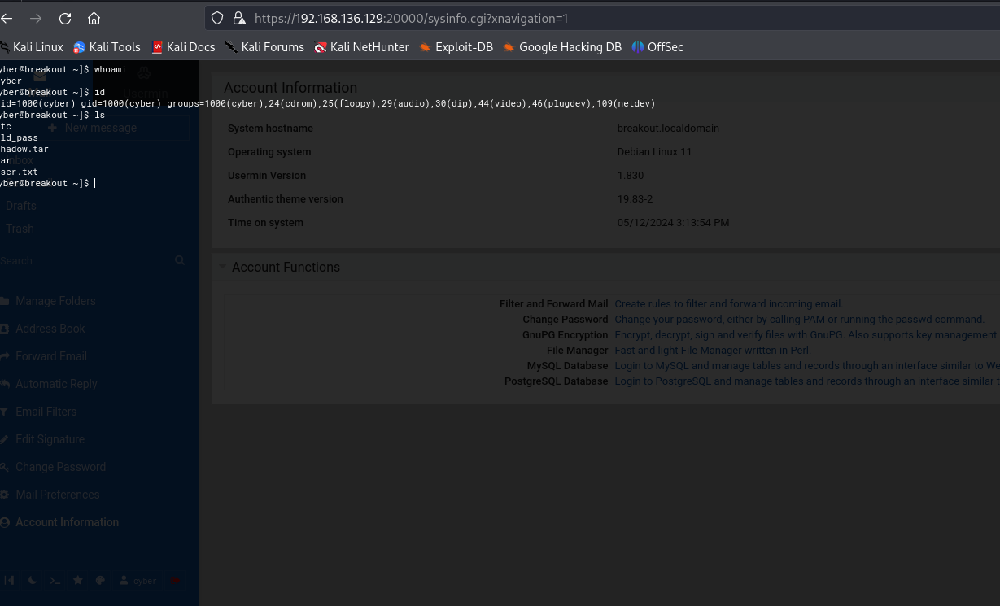

# Empire Breakout Walkthrough
Greetings, fellow hackers and curious minds! Today, we'll tackle the Empire Breakout2 machine from VulnHub, aiming to crack its defenses and snag root access. This box is rated as an intermediate level challenge, perfect for those looking to hone their skills. And don't worry, our virtual teacher,**White J**, will be guiding us every step of the way! Let's dive in and have some fun!


## Connection

We will be using VirtualBox as our preferred virtualization platform. VirtualBox is a popular choice for many hackers and security professionals due to its ease of configuration, user-friendly interface, and robust feature set.
The connection process can be a headache, even for Network Engineers and Experts. We will be connecting through Bridged Network() 
Firstly find your IP address using **ifconfig**—because even the most experienced Network Engineers and Experts need a reminder sometimes! 😄

```sh
ifconfig
```


**Kali (Attack Machine): 192.168.136.128**

Luckily, the machine has already been assigned an IP address and displays it:

 ``` sh
 "IP : 192.168.136.129" 
 ```


 So  we have our **Linux Debian (Victim Machine): 192.168.136.129**

Thank you Mr Breakout😎️!
 
 Things just got a whole lot easier😉️😉️😉️
 
 But to be thorough pentesters that we are, we have to still run our arp scan to see all the connected devices on our network using the arp-scan or netdiscover

```sh 
"sudo arp-scan -l"
```

#### Or

``` sh 
"sudo netdiscover -i eth0 -r <Ip address range>.0/24 "
```

 

 I think we  know the culprit by now

 ## Enumeration

Let start  gathering some juicy info , starting with nmap
We need to know which port is open and what services are running there
```sh
"nmap -sV -sc -A- -p- <Victim's Ip address>"
```


From the above results, we see some ports open:

| PORTS  | SERVICES     |
|--------|--------------|
| 80     | HTTP         |
| 139    | SMBD         |
| 445    | SMBD         |
| 10000  | HTTP WEBMIN  |
| 20000  | HTTP WEBMIN  |


The OS is Linux 4.15 -5.8

Using Nikto to check  web vunerabilities

```sh
"sudo nikto -h http://<Ip Address of Victim Machine>"

```

 

So far nothing juicy....hmmmmm


## HTTP PAGES

Let us check on the Http pages that nmap told us about

**Port 80 - We have a default Apache Page**

 

 **Port 10000:**
 

**Port 20000:**
 


 We find a login page , where do we find the user and login?🤔️🤔️

Let us inspect the page source if we can find some juicy info

 

 🔐 Encrypted Password Alert! 🔐

🕵️‍♂️ "Where is the user?" you ask? Well, that's for us to find out!

🤔 Hmm, but what hashing technique was used to encrypt this password?

🧐 Let's dive in and unravel the mystery!

💥 Time to sharpen our tools

## USER ENUM

We are going to make use of a tool called **Enum4linux**.
 Enum4Linux is a Linux-based enumeration tool that is used to gather information about a target system. It is a Perl script that automates the process of enumerating various aspects of a target system, including:
• User accounts
• Network information
• System information
• Services and ports
• Shares and file systems
```sh
"enum4linux <ip address>"
```


Phew....that was a lot of data, not really that easy but really worth it because we found a user: Cyber.

Now we have a user and an encrypted password hash.

Nice one, you are getting the hang of it.

## DIRECTORY BURSTING

Lets look on further for more, hidden directories using gobuster 
```sh
"gobuster dir -u http://<ip address> -w /usr/share/dirbuster/wordlists/directoy
```


Nothing useful nor interesting  here, no hidden pages nor directories.

## GAINING SHELL

Let's go back to our encrypted password
After a long search, we find out that the encryption used is of a language called BRAINFUCK PROGRAMMING LANGUAGE. Peculiar right?
I  can totally understand. Unless you have no life and plenty plenty time in your hands, please dont create or write a programming language 
So using a BrainFuck decoder  tool online , we are able to decode the hash  and get the password


Now let us login using the  decoded password and the user  we found earlier <cyber>

We are in. Good job!

Nice,we see a shell below
lets check our id and priviledges
``` sh
"whomai"
"id"
```



Let us set a listener so we can have a nice shell form our machine


we have our first flag
Now lets go further and get that root priviledge

## PRIVILEDGE ESCALATION

The aim of every pentesting is to gain root priviledges.

Why?

**It allows the tester to complete control over the system. In real life situations, the tester will be dealing with hundreds and hundreds of machines on one network,Root allows the tester bypass security restrictions,access sensitive data, install tools and backdoors and so other good stuff so we should always aim for root**

Lets check for binaries we can use 

 Remember at  Cyber/ Home, we see a tar binary.The tar command in Linux is used to manipulate archive files, also known as tarballs. Tar stands for Tape Archive, and it was originally developed to write data to sequential I/O devices like magnetic tapes. However, it is now commonly used to bundle multiple files into a single archive file, often with compression.
  After  some highlighting here and there,  We found that the binary in the home directory is just the tar command. I used the getcap command on the binary to find out more information.

  ```sh
  " getcap -r / 2>/dev/null "
  ```
  


You know what that means ? So basically we  could use this to read any files. Are you thinking what i am thinking??YeS!!!! You are right, the shadow file.Yes the onethat contains the password hashes of ever user on the machine


Uhh-oohh, we dont have permission to view the file but we have tar to do that for us
```sh 
 " ./tar -cvf shadow.tar /etc/shadow "

```


We can now view the shadow files using  tar 


Finally, the hashes but unfortunately John the ripper could not crack neither Hydra (wordlist does not contain it)
let do some more digging

## ROOT PRIVILEDGES

 After a loooong (no exxergerartions) searching, we come across a backup file in the /var/ folder
 We are going to see the same tar to view the  backup files

 
 You know how we do it, using tar
  ```sh
  " ./tar -cvf old_pass /var/backups/.old_pass.bak "
  ".tar -xvf old_pass"
 
  ```
 
 
 
 ```sh
 "cat var/backups/.old_pass.bak"
 ```

 And we have the password 
 ```sh 
   " Ts&4&YurgtRX(=~h "

 ```
 See that root passwd, its worth everything

 

 Now let us switch to root using the password 
 

 Let spawn a nice bash shell and get our flag

 

Did you notice anything? i kinda made it visible, so i created a backdoor, changed the password , did some cleanup,deleted my fingerprints and history and upgraded some files😉️. Always remember to do your cleanup.

 
 Here you go, you deserve your flowers!

 

Thank you for your time and i hope you enjoyed this walkthrough


by **whitej**