# Welcome to the maddness: Grotesque2, where vulnerablities lurk behind every corner

Hey, class! It’s your favorite teacher **WhiteJ** here, ready to lead you through another thrilling journey into the world of hacking! Today, we’re diving into the **Grotesque** VulnHub machine, and let me tell you — it's not as ugly as it sounds, but it sure is **challenging**. 😏
This machine is a solid **medium** on the difficulty scale — tough enough to make you sweat, but not too much that you’ll want to flip your desk. Think of it as your perfect practice for improving those hacking skills. Expect some head-scratchers, but nothing we can’t solve together!
 [Grab Grotesque here!](https://www.vulnhub.com/entry/grotesque,xyz) and Let’s show this machine who’s boss. 💻💪

 # 🛠️ Setting Up the Playground

Alright folks, before we start poking at **Grotesque**, we’ve got to set up a stable connection. Think of this as plugging into the monster’s brain—scary, but necessary. Let’s make sure we’re on the same network and ready to go.
Using a **bridged connection** is like saying, "Hey Grotesque, I’m in the same room as you. Let’s chat!" This method connects your Kali box directly to the same network as Grotesque.
 First is we use the arp scan to find  our target IP 
 
```sh 
"sudo arp-scan -l"
```

#### Or

``` sh 
"sudo netdiscover -i eth0 -r <Ip address range>.0/24 "
```


## 2. Reconnaissance: Scanning the Creature
Let's fire up the scanners and take a look at what's hiding under Grotesque's skin!. To our surprise, the Nmap results reveal that ports 22 to 555 are running the same service, yet they remain closed. Quite intriguing, isn't it?
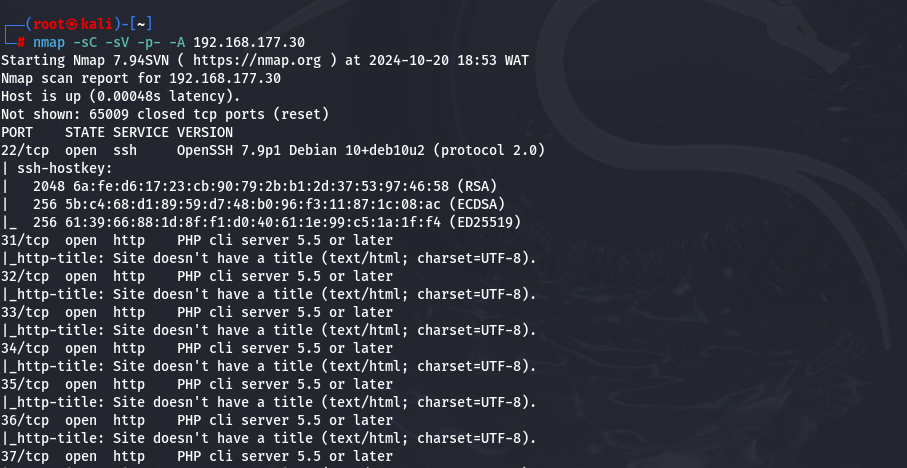


## 3. Enumerating the Guts
It's time to dig deeper—let's find those hidden directories and services!. We check the homepage and we see just an image

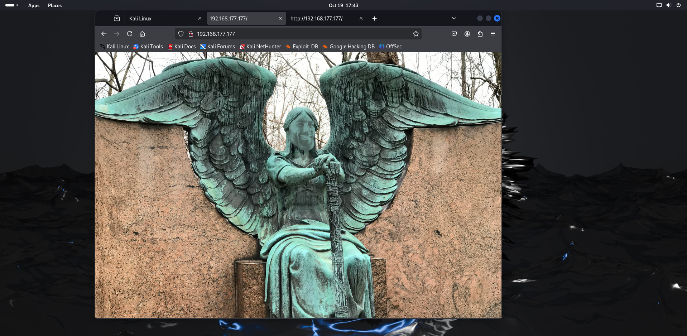

When we peek into hidden directories, it’s like finding a surprise party with no guests—nothing interesting at all! Now, we need to take a moment to fuzz through those open ports and see which ones might just have a little something special for us
``` sh 
"for i in {23..600}; do wget <targetip>:$i -O index$i; done"
```

This command tries to fetch data from each port in the range 23 to 600 and saves the response in individual files (index$i). If a port has more index ,them its has potentials.
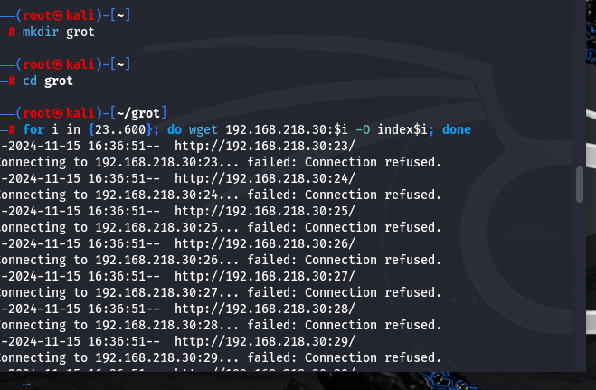

 Now we see that port 258 has the highest index, let us check the port

 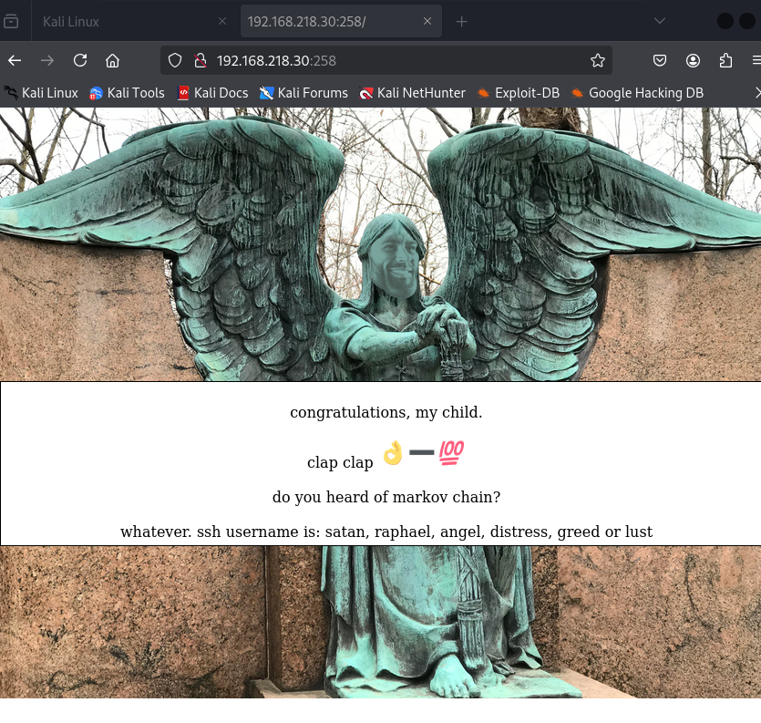

Amazing! We’ve uncovered potential usernames: Satan, Raphael, Angel, Distress, Greed, and Lust.

Here’s where things get fun. Markov Chain? Let us take a closer look at the image


The more we examine it, the more intriguing it gets—there’s a hash written on the hand! Could this be a clue?

 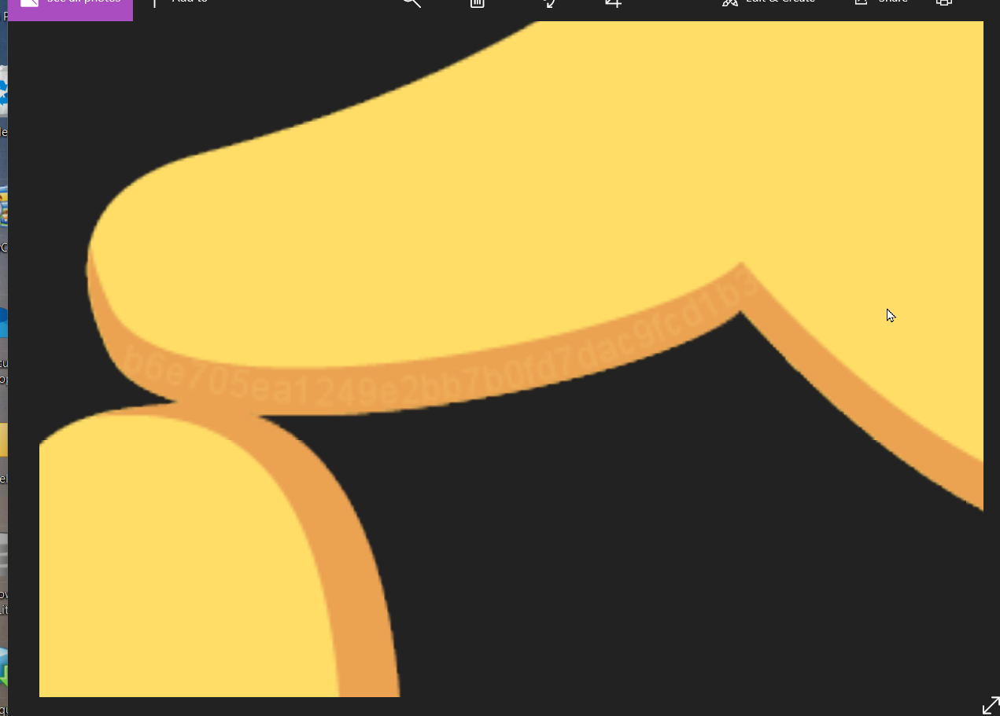
Notice the image is labeled hand-100. Could the hint be to subtract 100 from the hash? Markov Chain indeed!

 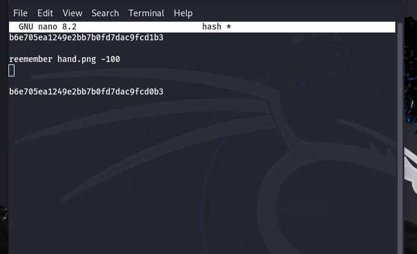
 We’ve got our swords and shields ready—time to start cracking... literally! 😂 Let’s go!

## 4. Exploitation: Breaking Into the Beast 🦁🔓

Alright, folks! We've got a username and a password hash. Time to unleash our secret weapon: **John the Ripper**! 🕵️‍♂️ Let's crack that hash like a nut!

```sh
john --wordlist=/usr/share/wordlists/rockyou.txt --format=raw-md5 hash.txt
```
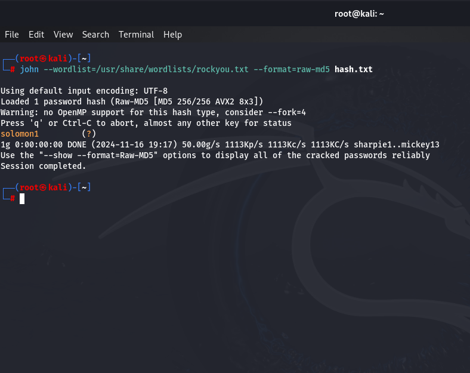

Boom! 🎉 We've got ourselves a password! What a victory! Now, let’s hunt down the right username.This time, we’re calling in Hydra for backup!

 ```sh
 "hydra -L user.txt -p solomon1 ssh://<TARGET IP>"
 ```

  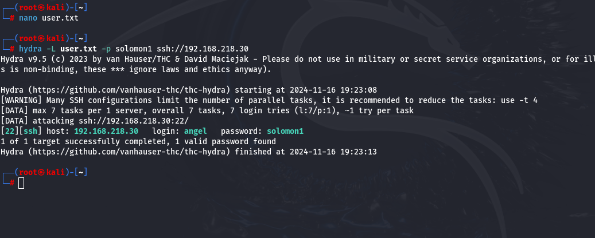
And just like that, we've snagged the username and password! 🥳 Now, let’s SSH into the machine with our shiny new credentials.

```sh
"ssh angel@<Target IP>"
```
 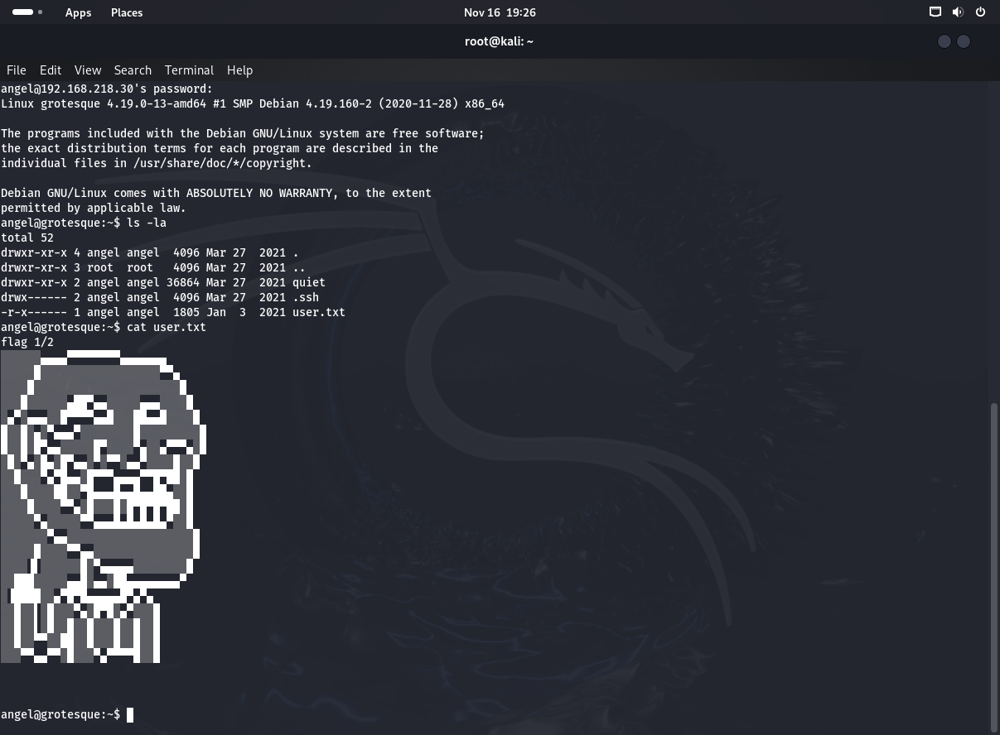

 And voilà! We’ve conquered our first machine! It was beautifully grotesque, indeed! 😈💻
## 5. Escalating Privileges: Climbing the Monstrous Ladder 🧗‍♂️🔑

Root access? Yes, please! 🙌 Let’s take this beast down once and for all! 

As we explore, we stumble upon a quiet little folder. But... it’s as exciting as watching paint dry😴

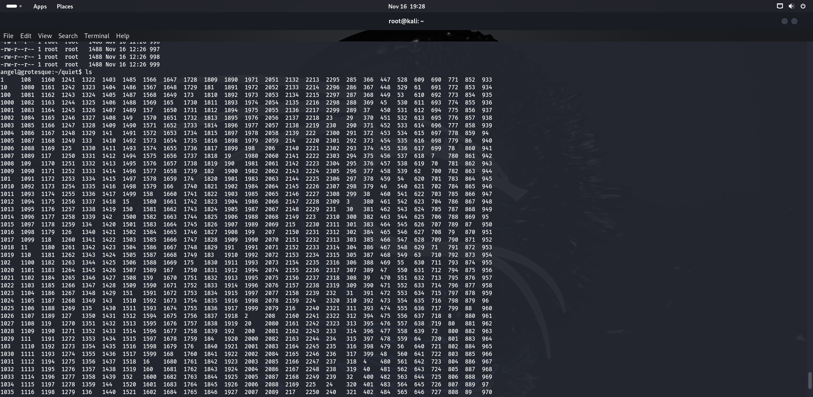

Time to bring in **pspy64s** to see what’s cooking behind the scenes! We notice it’s some script that’s checking this folder and writing data to it. Hmm... could this be our mysterious quiet folder? 🤔
Let’s spice things up! How about we clear out everything and give it another shot? 

```sh
rm -rf *
```

let us check agin 
```sh
ls -la /
```
And there it is—your root access! 

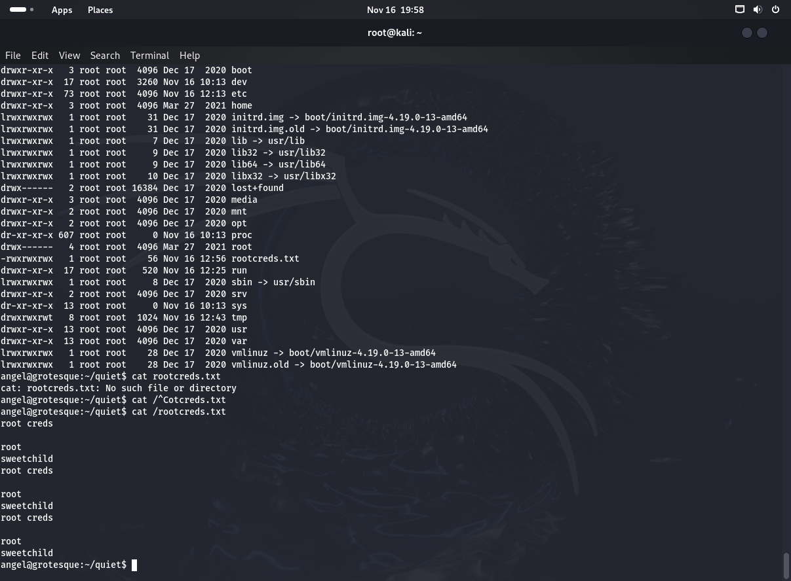

Time to raise our flag high because we’ve earned it! 🏴‍☠️

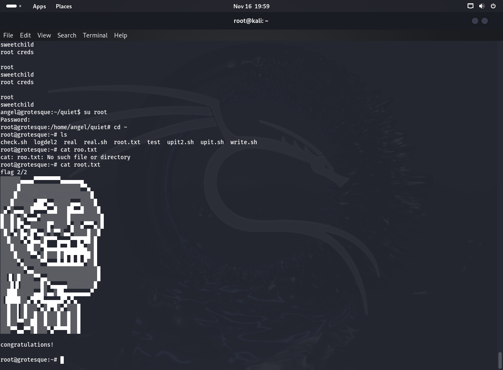

## 7. Conclusion: Slaying Grotesque
hat’s a wrap! Another monster down. Congrats on conquering the Grotesque machine! I hope you enjoyed this walkthrough with your trusty sidekick, White J! 🥳
