# Jangow 1-1.0.1: The Vulnerable Machine That's Easier to Crack Than a Bad Joke

Welcome to the Jangow 1-1.0.1 walkthrough with **whiteJ**!. This vulnerable machine from VulnHub is rated easy, so get ready for a fun adventure. Imagine yourself as a digital treasure hunter, armed with your trusty laptop, as you navigate through this light-hearted maze of common misconfigurations and vulnerabilities. Get your enumeration skills ready and let’s dive into the hilarity of hacking

Grab your virtual whip and download the [Jangow 1-1.0.1 machine here](https://www.vulnhub.com/entry/jangow-101,754/) .

Let's get hacking!

## Lab Setup

To follow along, we'll be using VirtualBox with a bridged network connection. To get started, we'll begin by identifying the target machine's IP address using the 'arp-scan' tool.

```sh
 sudo arp-scan -l
```
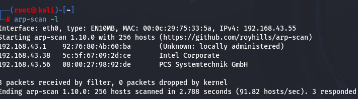
We have :

- **Target Machine :** 192.168.43.56
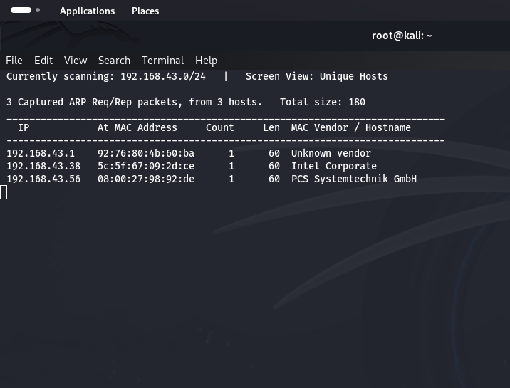


Another important step is to check if the machine has internet access. Many tutorials skip this, but not us!

Do a quick ping scan to Google to see if packets are transmitted and received.

**Ping Google**

```sh
ping google.com
```
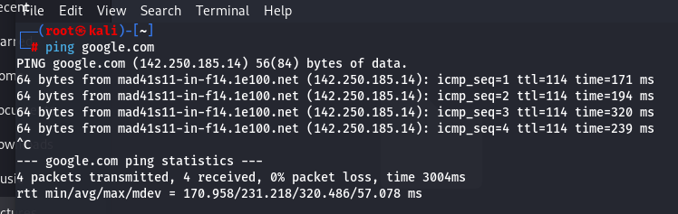

Next, ping the victim's IP address to see if the host is up and communicating.

**Ping Victim**
```sh
ping <IP address>
```
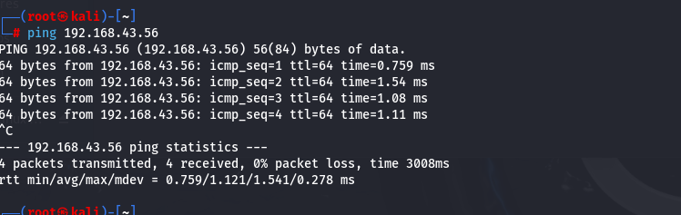

Okay, So we have our
Communication check: ✔️✔️✔️
Internet connection check: ✔️✔️✔️
Now we're ready to roll!
-
## Enumeration
Now that we have a better understanding of the system, it's time to get our hands dirty and dive into the enumeration process. This stage involves using various techniques to uncover potential vulnerabilities and gain access to the system.

For this task, nmap is our best friend, as it can help us identify open ports and the services running on them. With this information, we can narrow down our attack surface and focus on exploiting the most promising vulnerabilities.


### Nmap Scan

```sh
nmap -sV -sC -p- -A <IP address>
```

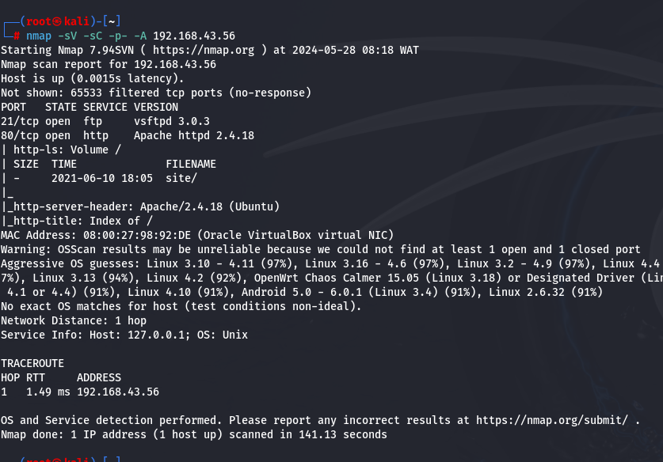

Using Nmap, we discovered the following open ports:

**21 (FTP)**
**80 (HTTP)**


Let us try see if we can ftp our way on thr FTP using the anonymous credentials

```sh
ftp <ip address>
login>anonymous
password>anonymous
```

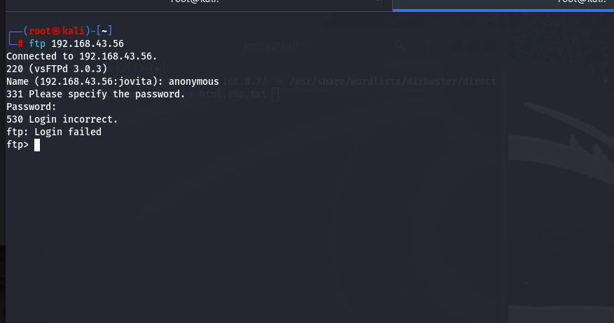

Unfortunately, this attempt did not yield any positive results. It seems we need to find another way to gain access to the system.

Next, we visited the web page at http://<target_ip> (Port 80).

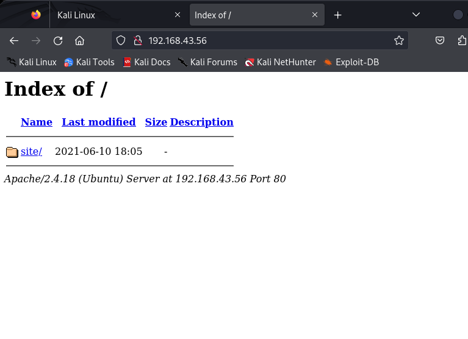

 Upon loading the index page, we clicked on the "site" link, which directed us to a static webpage.


## Directory Bursting
After roaming around, going through each link and viewing the source code, we do not find anything interesting. Nada. Zilch. Not even a crumb! 
But we are not going  to throw in the towel. With a glint of determination (and a bit of desperation), Let us revisit the /site directory and look carefully 
In the course of our looking,we stumble upon a page named "Buscar." Now, for those of you who didn't sleep through Spanish class, "Buscar" means "to find." 
Let us hope it would live up to its name  and find us something but "Buscar" is showing a blank page.Very dissapointing I would say  but we should take notice of its HTTP request type.

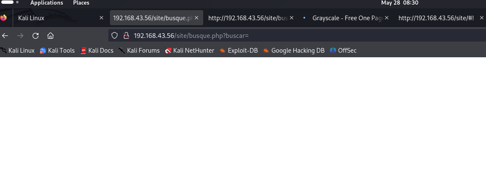

so lets employ the use of gobuster to help us fish out other directories

```sh 
gobuster -u http://192.168.43.56 -w /usr/share/wordlists/dirbuster/directory-list-2.3-medium.txt -x html,php,txt 
```

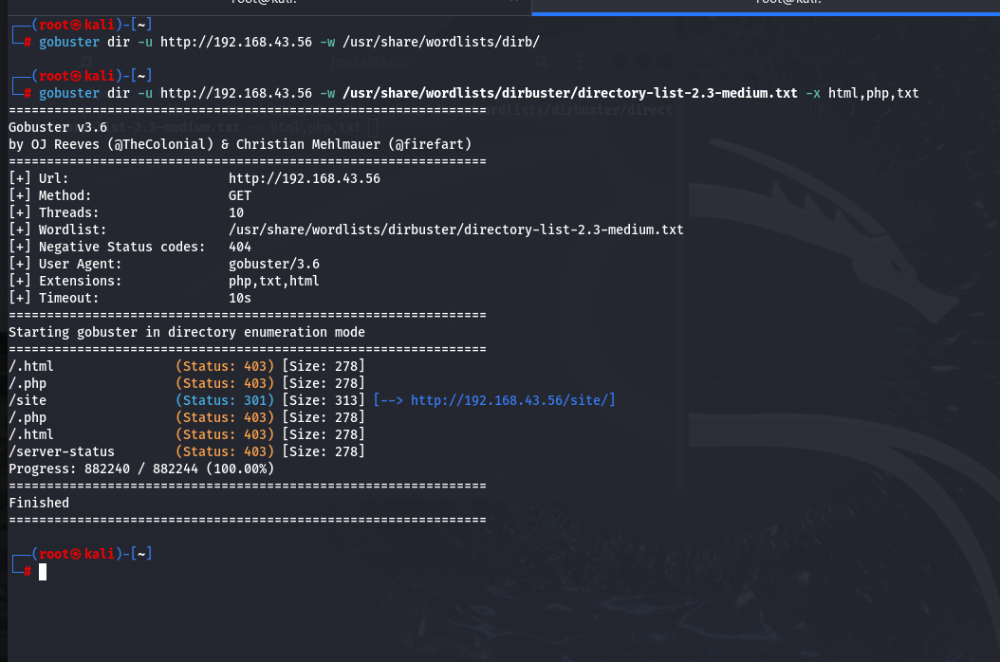

Nothing interesting .Let us go again this time, on the '/site' directories

```sh 
gobuster -u http://192.168.43.56/site -w /usr/share/wordlists/dirbuster/directory-list-2.3-medium.txt -x html,php,txt 
```

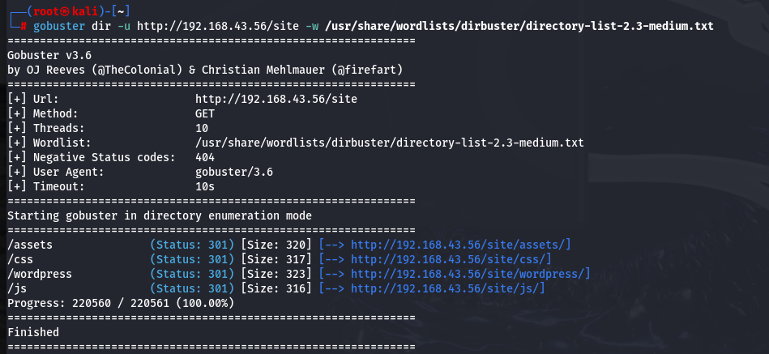

Finally, we see a WP directory. We know what that means. This implies that the target system is running a WordPress site, which opens up several potential avenues for further exploitation.

```sh 
gobuster -u http://192.168.43.56/site/wordpress -w /usr/share/wordlists/dirbuster/directory-list-2.3-medium.txt -x html,php,txt 
```


There is   WP config.php file. As we all know , the wp-config.php file is like the control center for your WordPress site, managing crucial settings and security details.


## Gaining Shell

Let us go back to our /buscar page. We see an '=' symbol in the URL. This is saying something.Who knows? there might be an OS Command Injection chance here. So, we are going to  grab the request with Burp Suite for some extra flexibility. After snagging it, we will shoot the captured request over to "Repeater" to mess around with it more.

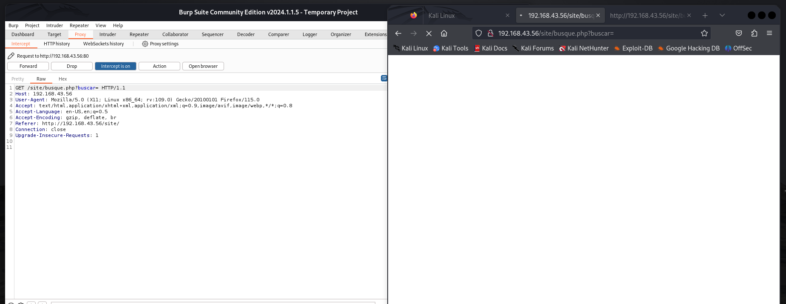

**How do we do that?**
Ensure that your browser is configured to use Burp Suite as its proxy. A convenient way to do this is by utilizing the FoxyProxy extension. With this setup, you can easily add Burp Suite as a proxy, streamlining the process.
Next, follow these steps:

Open Burp Suite.
Enable the interceptor.
Load the page from your browser.
Inspect the HTTP response for the '/buscar' request.
Send the request to the repeater

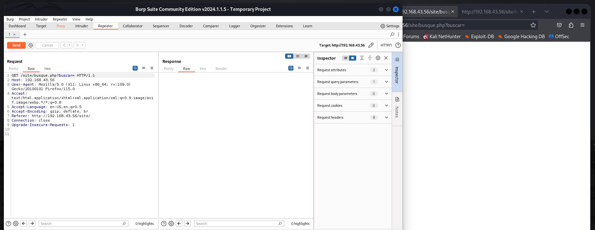

With this repeater, we can view the wpconfig.php file by encoding it into the URL encoding format.

```
cat%20wordpress%2Fconfig.php
```

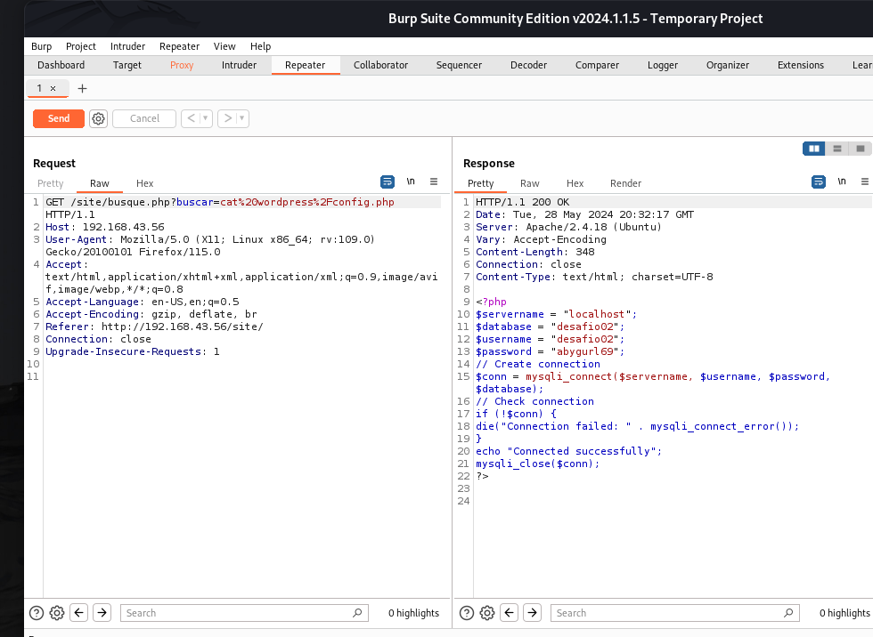

We've got our hands on a database username and password! Time to get our sneak on and login via SSH remote login with these sweet credentials.


This for some reason is not connecting.Oh, the ssh port is not open. Let's try again, this time with the /etc/passwd files. Why, you ask? Well, because this file is like the ultimate cheat sheet - it's got all the users and password hashes just chillin' in there, waiting to be used.

```
cat%20%2Fetc%2Fpasswd
```
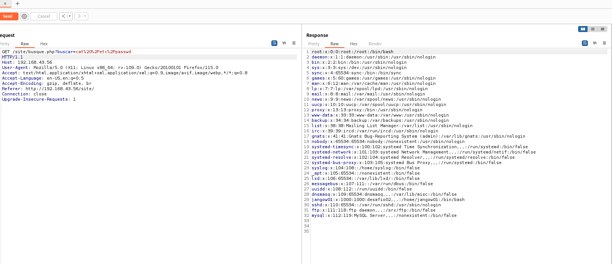


We find out that the database credentials belonged to a user named **Jangow01**. So, we are going to do some detective work and cross-check the /etc/passwd file and the wordpress/config.php file - what if we try combining the username from the passwd file (jangow01) with the database password from the config file (abygurl69)? I mean, it can lead somewhere, and...

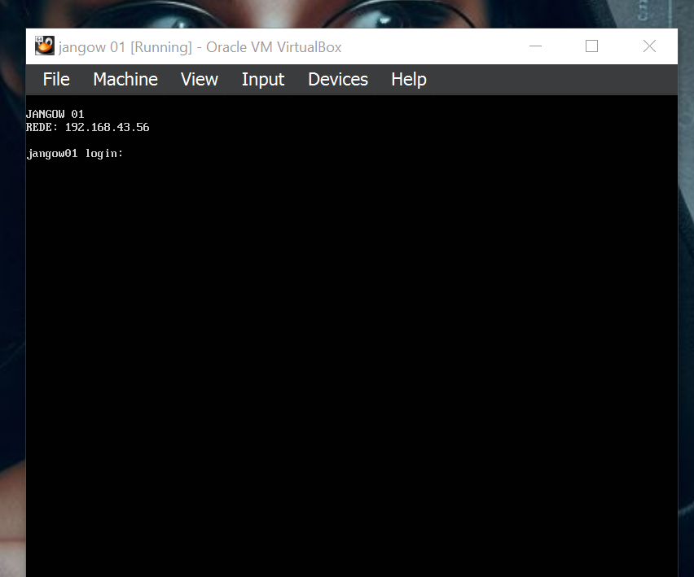

 IT WORKED!!! Woohoo! We are  in! We've got access to the system! 

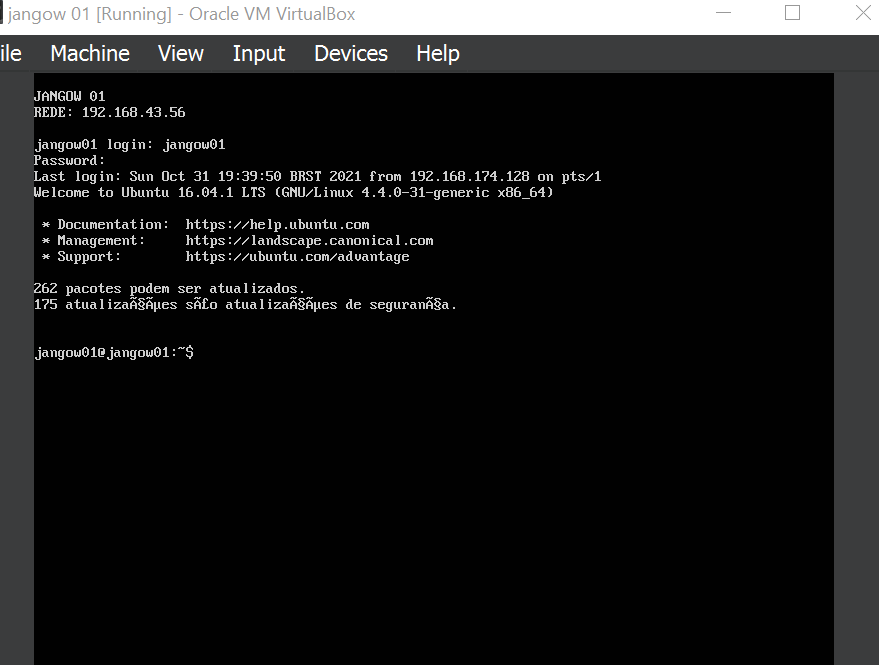

 Let go around and find our id and priviledges

 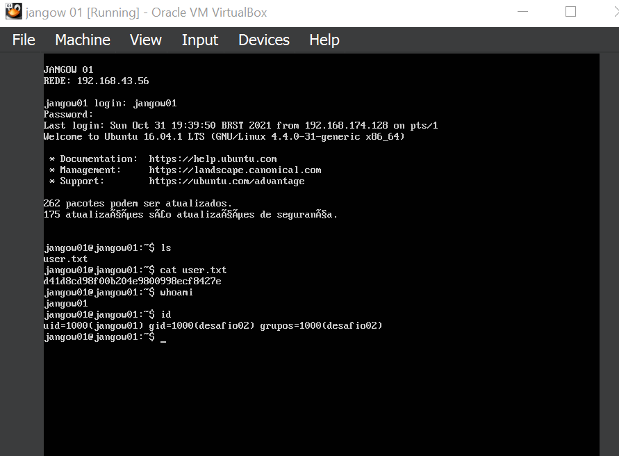

 We found our first Flag.....where are the fireworks?🎉🎇🎆🎊🎉🎇🎆🎊🎉🎇🎆🎊🎉🎇🎆🎊
 
 

## Gaining Root
We might have gained shell as jangow1 but you know  we are not going to stop there.We need to escalate our priviledges to root.Escalating privileges to root is like leveling up in a game - it gives you more power and control over the system. Let us find out about the kernel

```sh
uname -a
```
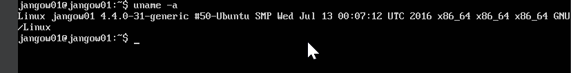.

Let us search about the probable vunerability of such kernel. Finding Linux kernel exploits can be tough, and local privilege escalation exploits are pretty rare. Luckily, Exploit-DB has all kinds of exploits, including local privilege escalation ones (thanks, Exploit-DB!). But testing them can be tricky because of how they work.

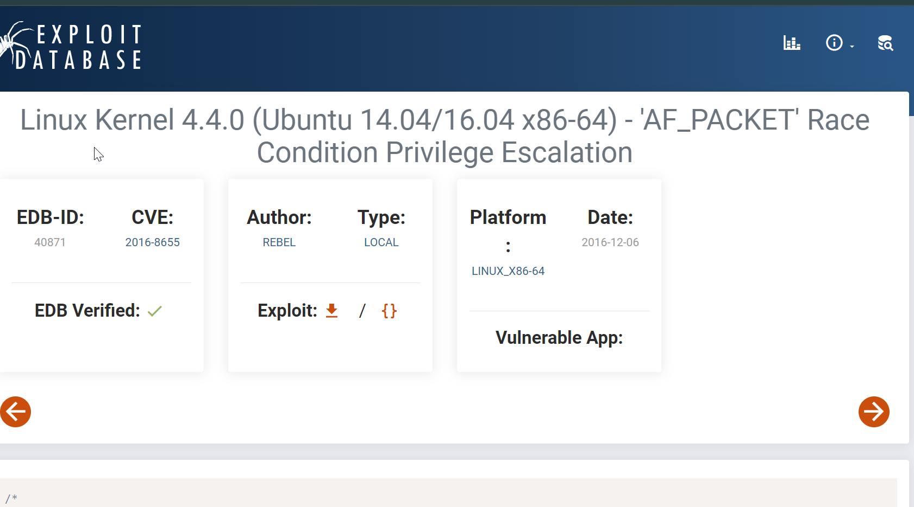

We can see that it is vulnerable to a race condition in the 'AF_PACKET' protocol, which allows for privilege escalation. We are going to 

--- Get the Exploit: Find and download the exploit program from a reliable source, such as Exploit-DB. You can  download the [exploit  wrtten in .C here](https://www.exploit-db.com/exploits/45010).


--- Transfer the Exploit. Remember during our recon we found the FTP port open.We are going to move the exploit program to the target machine using a file transfer method in this case FTP.

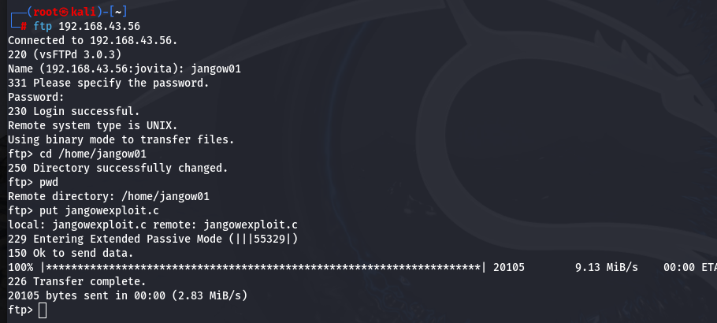

--- Compile the Exploit: If the exploit is in source code form (e.g., a C file), compile it using the gcc compiler:

```sh
gcc -pthread jangowexploit -o jangowexploit
```
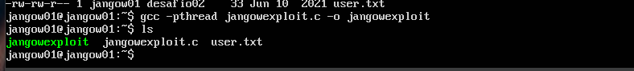

After that, we simply run the exploit

```sh 
./jangowexploit
```

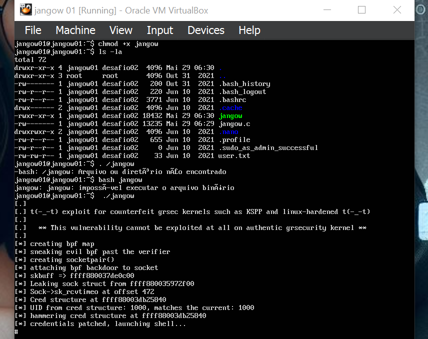

And we have done it. We are now root
```sh
whoami
id
ls /root
```

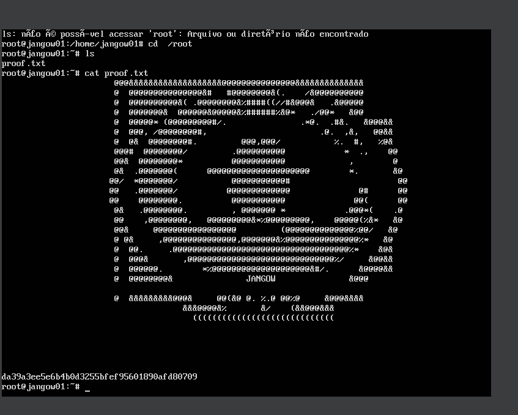


This brings us to the end of this walkthrough, Folks. I hope you enjoyed it -With enumeration opportunities galore, this machine was a dream come true for newbie hackers and seasoned pros alike. It's like the creators of Jangow 1 wanted to say, "Hey, we know you're new to this whole hacking thing, so let's make it super easy and fun for you!" 🎉

So, if you managed to pwn this machine, congratulations! You've earned your "I survived Jangow 1" badge 🏆. If not, don't worry, it's all part of the learning process. Just remember, practice makes perfect, and Jangow 1 is the perfect machine to practice on 🤓.


Thanks for joining , and we'll catch you on the flip side! 


***WhiteJ**👋👋👋