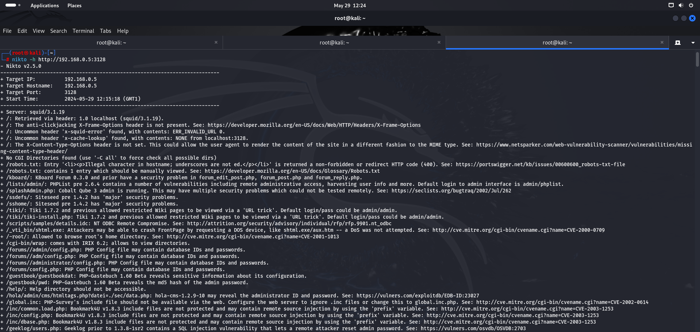

# Welcome to the SickOS 1.1 Walkthrough with Whitej!

Welcome, brave adventurers, to the sickOS 1.1 walkthrough! Get ready to dive into this virtual playground of vulnerabilities and challenges. Guiding you on this epic quest is none other than the legendary virtual teacher,**WhiteJ**. Together, we'll cure the  sickOS 1.1 and make it healthy again
I'd rate the difficulty of SickOS 1.1 as a 7 out of 10. This machine requires a solid understanding of Linux fundamentals, network exploitation, and creative problem-solving. While it's not an easy machine, it's definitely accessible to intermediate-level hackers looking to improve their skills.Our objective here  is to gain root access(and of course bragging rights)

Download and Set up [sickOS 1.1 machine here](https://www.vulnhub.com/entry/sickos-11,132/) from Vulnhub


## Connection Setup

Before we storm the gates of sickOS 1.1, let's make sure our network setup is solid. We're using VirtualBox and Bridged Mode to connect our virtual machine. Think of it as giving sickOS 1.1 a VIP pass to your local network.
We'll continue  by identifying the target machine's IP address using the 'arp-scan' tool.

```sh
 sudo arp-scan -l
```


We have :

- **Target Machine :** 192.168.0.6


As i always  like topoint out in all our walkthroughs,ensuring that the machine has internet access is a crucial step often overlooked. First, perform a quick ping scan to Google to verify if packets are transmitted and received.

**Ping Google**

```sh
ping google.com
```


Next, ping the victim's IP address to see if the host is up and communicating.

**Ping Victim**
```sh
ping <IP address>
```


Now we are set!!!

## Enumeration

Now that we have a better understanding of the SickOS machine, it's time to dive into the enumeration process. This stage involves using various techniques to uncover potential vulnerabilities and gain access to the SickOS machine.

Our go-to tool for this task is Nmap, a powerful port scanner that helps us identify open ports and the services running on them. With this information, we can narrow down our attack surface and focus on exploiting the most promising vulnerabilities.

### Nmap Scan

```sh
nmap -sV -sC -p- -A <IP address>
```


Using Nmap, we discovered the following open ports:

**22 (ssh)**
**3128  (HTTP)**
**8080 (HTTP), closed**

Let us go to the home page on port 3128


There is nothing really going on here...
 
### Web Vunerablity Scan With Nikto

In addition to using Nmap, we can also scan for web vulnerabilities using Nikto, a popular web server scanner.

```sh 
nikto -h http://192.168.43.56:3128 
```
Phew! This is one seriously sick OS... There's a ton of data, interesting files to explore, and vulnerabilities to uncover.




Interesting...


## Gaining Shell

After running Nikto, it's clear that the SickOS machine is vulnerable to the Shellshock vulnerability. Our next step is to try and access the vulnerable directory.

However, we can't access it directly. To overcome this, we'll use a manual proxy to access the host using the port we got from nmap. 


And now reload the page


BLEEH???..Feeling nauseous?? Not for so long, sickOS..Not for so long.Help its on its way.Hahaaha

Now, let us find its kernel version and OS details using   **/cgi-bin/status** in the URL  and see where that leads us to


Let us check couple of .txt files we saw in out nikto results

---human.txt


Nothing 

--- robots.txt


Let us check the URL **/wolfcms**


Ahaaaaa!!!1...some progress at last. This is a CMS page  which means there should be an admin running it and from our nikto scan, we saw a /login directory. Let us try **/login**

 
 And we got this luve-ly login page. what next? we dont have any credentials so let us try with the default credentials of admin panel

 
 

 We are in...Surprisingly, that went well but our goal is to gain shell then root access. To do this, we'll upload a shell.The FILES tab in the screenshot is our upload spot. We'll use a PHP reverse shell from PentestMonkey


We upload the PHP reverse shell. [Check out the reverse shell by pentestmonkey here](https://pentestmonkey.net/tools/web-shells/php-reverse-shell).

 


Next, we set up a listener on our system with Netcat to catch the reverse connection.Once the listener is ready, we initiate the reverse connection from SickOS. This will grant us root access and let us explore the system further.


Nice.We have successfully obtained a reverse shell. With this, we  can bypass the need to search for files in different locations, we can directly access and manipulate the necessary files.
Welldone!!!


## Priviledge Escalation

Now that we have successfully got in as www.data,the real party is about to start. It's not just about getting in; it's about getting the keys to the entire place. So we need to escalate our priviledges like we are upgrading from coach to first class😄😄😄
Firstly let us see what is in our directories


There is   WP config.php file. As we all know the WP config.php file plays a vital role in aWordPress site, serving as the command center where you oversee essential settings and security details. Let us view the contents


Viola! a username and password. This just keeps getting better.
Alright, here's where things get interesting. We've obtained the MySQL username and password. We also know that SSH is up and running. Why not give it a shot? Initially, we attempt to log in via SSH using 'root' as the username, but that didn't work. Then, why not try the machine's name itself? 


It worked! IWe should be was to log in using the password we found in the config.php file.

## Gaining Root

We are in as **sickos** who is clearly an admin, so what next?. From here on, we attempt to navigate into directories but encountered 'permission denied' errors, indicating that we don't have root privileges. 
But remember, we are administrator user (sickos) so we have permissions and credentials to use the **sudo** commmand. So 
```sh
sudo su root
```


And we are root!!..where are the fireworks? 🎊🔥💥🎉🎇🎆🎊😍👏💫🎊
 
 

Let u sview the directories and find our flag


As we conclude our journey through SickOS 1 walkthrough, I hope you found the experience enlightening and enjoyable.This machine truly stands out with its unique challenges and opportunities for growth. It's like solving a complex puzzle, where each step brings you closer to understanding the bigger picture.

Thank you for joining me on this adventure. I hope you feel inspired and motivated to continue exploring the vast and fascinating realm of ethical hacking. Until our next journey, happy hacking! 😊💻🚀 


***WhiteJ**